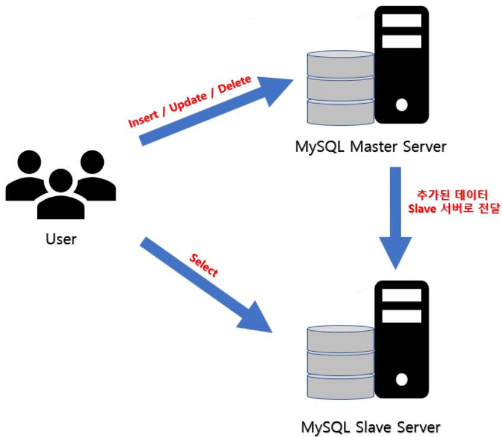
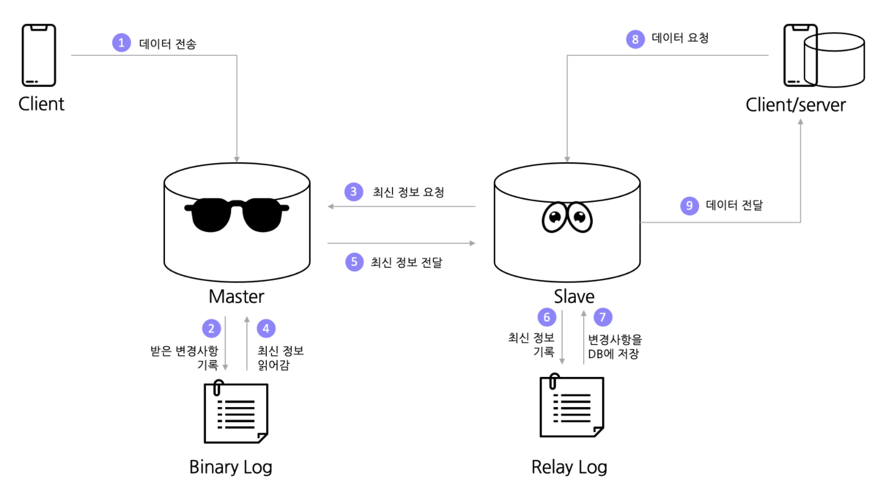

# DB(Master&Slave구조)

DB에 대한 트래픽 분산을 위해서 Mysql Replication 등 을 통해서 트래픽 집중 문제를 해결



Master에게는 데이터 동시성이 높게 요구되는 트랜잭션을 담당하게 하고, Slave에게는 읽기 전용으로 데이터를 가져옴.




1. 클라이언트가 마스터 DB 서버에 데이터를 전송
2. Master 서버는 들어오는 데이터를 Binary Log라는 메모장에 적어두었다가 때가되면 DB에 업데이트.
3. 이 와중에 Slave 서버가 최신 데이터를 요청.
4. Master 서버는 Binary Log에 적어둔 최신 정보를 읽어서 Slave서버에 전달.
5. Slave 서버는 이 정보들을 자신의 메모장인 Relay Log에 적었다가 나중에 한번에 변경사항을 DB에 등록.
6. 다른 클라이언트나 서버가 데이터를 요청하면 Slave 서버가 동기화된 데이터를 전달.

<br>

<br>

## 복제 지연

#### 원인

**Long Query**

Statement Based Replication 으로 복제하고 있는 상황에서 쿼리를 Slave에서 replay 해야하는 경우입니다. 1시간 소요되는 쿼리라면 슬레이브에서 쿼리가 실행되는 1시간 동안 복제 지연이 발생할 수 있습니다.


**Write 쿼리량 증가 (데이터 사이즈 증가)**

순수하게 write 쿼리가 증가 했기 때문에 복제해야하는 양이 많아지면서 지연이 발생할 수 있습니다. 이는 서비스 사용량 증가 때문일 수도 있고 특정 시간대에 배치 작업으로 인한 영향일 수도 있습니다.

서비스 사용량 증가 때문이라면 복제 지연은 계속 벌어지기만 하고 앞으로 영영 마스터를 따라잡지 못할 수도 있습니다. 하지만 보통은 새벽시간대에 한가해지기 때문에 낮에는 벌어지고 밤에는 따라가는 상황이 반복될 수 있겠습니다.


**락 이슈**

슬레이브에서 락(metadata lock 등)이 걸려서 쿼리가 제대로 수행되지 않는 경우일 수 있겠습니다. 이경우 락의 원인을 찾아서 해결해주셔야 합니다.


**하드웨어 이슈**

BBU 충방전으로 인해 캐시를 사용하지 못하게 되거나,는 THP 확보를 위한 IO증가가 서버의 write 성능에 영향을 미쳐서 결과적으로 DB 성능도 저하시킬 수 있습니다. 즉 OS 파라미터도 같이 튜닝을 해야하겠죠.

간혹 하드웨어 성능 자체가 느려서 발생하기도 합니다. 최근에도 21세기에 7200 rpm 하드디스크를 구매해서 사용하는 사례도 있었습니다.


**슬레이브 로드 증가**

슬레이브에서 실행되는 서비스 read 트래픽, 배치 쿼리 또는 백업으로 인해 슬레이브 사용량이 증가하면서 평소보다 처리 성능이 지연되면서 결과적으로 복제 지연이 발생할 수 있습니다.


**데이터 불일치 (복제 중단)**

이 경우는 지연이 아니라 중단 케이스 이지만, 중단이 길어지면 복제 지연을 유발할 수 있습니다.

마스터와 슬레이브는 기본적으로 shared nothing 아키텍처 입니다. 그러다보니 데이터가 불일치 되는 경우가 생깁니다. 쿼리의 문제일 수도 있고 누군가 슬레이브에 write 를 했기 때문일 수도 있습니다.

delete 하려는 row 가 없거나 insert 하려는 row 가 있을 수 있습니다. 이런 경우는 슬레이브는 적용여부를 판단할 수 없기 때문에 복제를 중단하고 에러를 발생시킵니다.

<br>

<br>

## 복제 지연 해결 방법

**쿼리 성능 향상**

Long Query 때문이라면 해당 쿼리의 실행 속도를 향상시킴으로써 해결할 수 있습니다.

쿼리 자체를 변경할 수도 있고, 간단하게 인덱스 추가만으로도 해결이 가능합니다.


**Multi-Threaded Replication 설정**

복제를 적용하는 worker thread 개수를 늘려서 처리 속도를 향상 시킬수 있겠습니다.

개수가 무작정 많다고 좋지는 않습니다. 테스트 결과에서 16개 이상은 무의미 했던 경우가 많습니다.

개수를 적절히 조정해 보시면서 work load 에 맞는 설정을 하시길 바랍니다.

```sh
mysql> STOP SLAVE;
mysql> SET GLOBAL slave_parallel_type='LOGICAL_CLOCK';
mysql> SET GLOBAL slave_parallel_worker=8;
mysql> START SLAVE;
```


**SBR or RBR 확인**

쿼리 결과에 따라서 SBR (statement based replication) 이 좋을 수도 있고, RBR (row based replication) 이 좋을 수도 있습니다. 1시간 동안 수행된 쿼리가 결국 1건만 변경하는 쿼리였다면 세션에서 RBR 로 설정해보는 것도 방법일 것입니다.

```sh
mysql> SET SESSION binlog_format='STATEMENT';
or 
mysql> SET SESSION binlog_format='ROW';
```


**데이터 삭제 및 로그 분리**

전체적으로 데이터 양이 많을 수록 성능에 안좋은 영향을 미칠 가능성이 커집니다.

대용량 데이터일 경우 대고객 서비스에 꼭 필요한 데이터만을 남기고 나머지 로그성 테이블들은 다른 DB로 분리하거나 삭제하여 경량화하는 것도 고려해볼만 합니다. 고맙게도 사용량이 계속 증가하는 서비스라면 sharding 을 고민해보는 게 좋겠습니다. sharding 은 같은 스키마의 MySQL Cluster 를 여러 개 두어서 특정 ID 값을 기준으로 각 Cluster 로 분산해서 저장하는 방식입니다.


**DB 파라미터 튜닝**

write 에 영향을 미치는 다양한 파라미터를 튜닝합니다.

아래 언급만 파라미터들의 sync 주기를 느슨하게 하시거나 off 하시는 방향으로 설정해주시면 되겠습니다.

당연히 비정상적인 crash 상황에서 안정성을 해칠 수 있다는 것을 염두해 두시고 사용하시길 바랍니다.

(기본적인 파라미터들이라서 자세한 설명은 생략합니다.)

```properties
log_slave_updates
innodb_flush_log_at_try_commit
sync_binlog
binlog_group_commit_sync_delay
sync_relay_log
sync_relay_log_info
sync_master_info
binlog_row_image : 이미지를 얼마나 상세히 남길지..
relay_log_info_repository : 테이블로 설정할 경우 복제 성능에 영향을 미칠 수 있습니다.
```


**OS 파라미터 튜닝**

기본적으로 DB서버 성능에 영향을 미칠만한 OS 파라미터를 튜닝하는 것이 좋습니다.

DB서버는 항상 같은 성능을 낼 수 있도록 튜닝하는 것이 좋으며, 불필요한 IO 등을 일이킬 수 있는 설정들을 배제하는 방식으로 튜닝합니다.

> THP(transparent_hugepage) disable
>
> swappiness=1 : swap 발생을 최소화
>
> smart path disable : SSD의 경우 설정
>
> BBU 관련 : https://blog.naver.com/sory1008/220708000897
>
> CPU c state, p state off : cpu power 가 동일하게 유지되도록 설정
>
> NUMA off (항상은 아니지만 메모리가 대용량일 경우 메모리 불균형 할당으로 swap 사용의 위험이 높아집니다.)


**DB 엔진 변경**

TokuDB 로 엔진을 변경 및 마이그레이션 해서 복제 지연 문제를 해결하기도 합니다.

이 경우에는 사전에 많은 테스트를 거쳐서 이슈가 없는지 검증을 꼭 해야 하겠습니다.


**하드웨어 속도 향상**

RAID 1+0 구성이 되어 있는지, SSD 로 교체가 가능한지, CPU, Memory 등 업그레이드가 가능한지 검토해볼 수도 있겠습니다. Public Cloud 에서는 인스턴스 타입 변경이 비교적 자유롭기 때문에, 예전보다는 쉽게 접근해볼 수 있는 방법일 수 있습니다. 하지만 당연하게도 원인이 어느정도 확인이 되어야 설득력이 있을 것 같습니다.

