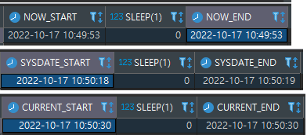

# [MYSQL]NOW(), SYSDATE(), CURRENT_TIMESTAMP() 차이

현재 일시를 가져오는 함수지만 그 기준이 다르다.

* **NOW**() : 쿼리가 수행되는 시각이 기준

* **SYSDATE**() : 함수가 수행되는 시각이 기준

* **CURRENT_TIMESTAMP**() : NOW()와 동일

```sql
SELECT NOW() AS NOW_START
     , SLEEP(1)
     , NOW() AS NOW_END;
    
SELECT SYSDATE() AS SYSDATE_START
     , SLEEP(1)
     , SYSDATE() AS SYSDATE_END;
    
SELECT CURRENT_TIMESTAMP() AS CURRENT_START
     , SLEEP(1)
     , CURRENT_TIMESTAMP() AS CURRENT_END ;
```



함수들의 차이를 확인하기 위해 쿼리문에 SLEEP() 줘서 비교해 보면 위와 같다.

NOW()와 CURRENT_TIMESTAMP() 는 SLEEP()이 있음에도 START와 END가 동일한 시각으로 반환이 되었고,

SYSDATE()는 SLEEP()을 준 시간만큼의 차이가 발생했다.

이로서 NOW()는 쿼리 수행 시각, SYSDATE()는 함수 수행 시각이 기준이란게 확인 된다.

<br>

> **--sysdate-is-now** 옵션을 사용해서 SYSDATE()와 NOW()가 동일하게 동작하게 설정이 가능하다.
>
> 해당 옵션을 true 설정하면 동일하게 동작한다.

