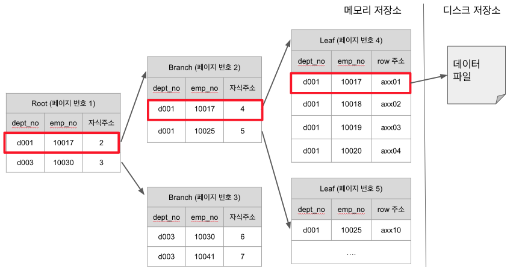

# [MYSQL]인덱스 정리

## 인덱스란

인덱스는 지정한 컬럼들을 기준으로 메모리 영역에 일종의 **목차를 생성**하는 것.

insert, update, delete 성능을 희생하고 대신 **select의 성능을 향상**.

update, delete를 하기 위해 해당 데이터를 조회하는 경우 인덱스가 있으면 성능 향상.

인덱스가 없는 컬럼을 조건으로 update, delete를 하게 되면 굉장히 느려서 많은 양의 데이터를 삭제해야하는 상황에선 인덱스로 지정된 컬럼을 기준으로 진행하는 것을 추천.



* B-Tree 인덱스 구조
  * 인덱스 탐색은 Root -> Branch -> Leaf -> 디스크 저장소 순으로 진행
  * 인덱스의 두번째 컬럼은 첫번째 컬럼에 의존해서 정렬.
  * 디스크에서 읽는 것은 메모리에서 읽는것보다 성능이 훨씬 떨어짐.
    * 인덱스 성능을 향상시킨다는 것은 디스크 저장소에 얼마나 덜 접근하느냐가 관건
  * 인덱스의 개수는 3~4개 정도가 적당
    * 너무 많은 인덱스는 수정/삭제시마다 인덱스 수정이 많이 필요해서 성능 이슈 발생 가능성 높음
    * 인덱스가 차지하는 공간이 많아짐
    * 많은 인덱스로 인해 옵티마이저가 잘못된 인덱스를 선택할 확률이 높아짐

<br>

## 인덱스 키 값의 크기

* 디스크에 데이터를 저장하고 읽는 기본 단위는 페이지 또는 블록 단위.
* B-Tree의 각 노드가 관리하는 인덱스 데이터의 단위 또한 페이지.(InnoDB 기본값 = 16KB)
* 각 노드(16KB)에 담길 수 있는 인덱스의 개수는 각 노드가 가질 수 있는 인덱스 키 값의 크기와 연관됨.
* 따라서 인덱스 키 값의 크기가 커지면 하나의 노드가 가지고 있을 수 있는 인덱스 키의 개수가 줄어들면서 효율이 떨어지게 됨.
* 결론 : 인덱스의 키는 길면 길수록 성능상 이슈 발생

<br>

## 인덱스 컬럼 기준

* **카디널리티(cardinality)가 가장 높은 컬럼**이 좋음
  * 카디널리티란 특정 열에 포함된 데이터의 고유성
  * 카디널리티가 낮을수록 중복된 데이터가 많음
* 인덱스로 최대 효율을 내기 위해서는 인덱스로 많은 부분을 걸러내야 하기 때문
* 카디널리티 확인 쿼리

```sql
select count(distinct id) as cnt from orders;
select count(distinct menu) as cnt from orders;
select count(distinct price) as cnt from orders;
```


#### 여러 컬럼으로 인덱스 구성시 기준

* 카디널리티가 **높은 순에서 낮은 순**으로 구성하는게 효율적

#### 여러 컬럼으로 인덱스시 조건 누락

* 조회 쿼리에서 인덱스를 태우려면 최소한 **첫번째 인덱스 조건이 조회조건에 포함** 되어야 함

## 인덱스 조회시 주의 사항

* `between` , `like` , `<` , `>`  등 범위 조건은 해당 컬럼은 인덱스를 타지만, 그 뒤 인덱스 컬럼들은 인덱스가 사용되지 않음.
  * 예를 들어 `a, b, c` 로 인덱스가 잡혀있는데 조회 쿼리에서 `where a = xx and c = yy and b > zz` 로 사용하면 `c` 는 인덱스가 사용되지 않음
  * `like` 뒷 부분 일치로 비교된 경우 인덱스 사용 불가
    * 앞을 기준으로 정렬되어 있기 때문
* `in` 조건은 다음 컬럼도 인덱스 사용.
  * `in` 은 인자값으로 상수가 포함되면 문제 없지만, **서브쿼리를 넣게되면 성능상 이슈 발생**
    * `in` 의 인자로 서브쿼리가 들어가면 서브쿼리의 외부가 먼저 실행되고 `in` 은 체크조건으로 실행되기 때문.
* 인덱스 컬럼 사용시 함수나 수식 없이 그대로 사용
  * `where price * 10 > 3000` 은 인덱스를 못타지만 `where price > 3000 / 10` 은 인덱스를 사용.
  * 컬럼 타입이 숫자인데 문자로 변환해서 조회하면 타입이 달라 인덱스가 사용되지 않음
* null 값의 경우 `is null` 조건으로 인덱스 레인지 스캔 가능
* Not Equal로 비교된 경우 인덱스 사용 불가 (`<>` , `not in` , `not between` , `is not null`)

## 인덱스 컬럼 순서와 조회 컬럼 순서

* 최근에는 이전과 같이 **인덱스 순서와 조회 순서를 지킬 필요 없음**
  * 순서가 다를 경우 **옵티마이저가 인덱스 컬럼 순서에 맞춰 재배열**하는 과정이 추가되지만 거의 차이가 없음