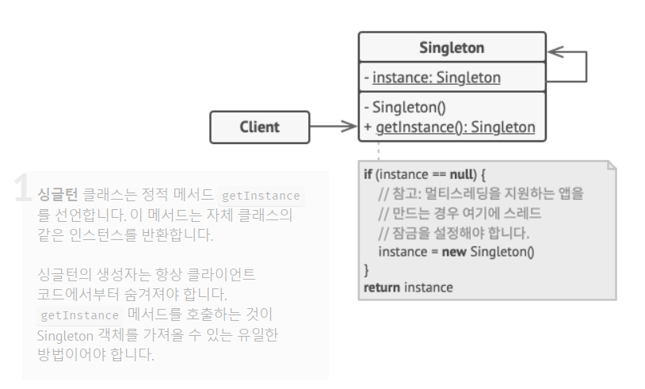

# 싱글턴 패턴(Singleton pattern)

싱글턴은 클래스에 인스턴스가 하나만 있도록 하면서 이 인스턴스에 대한 전역 접근 지점을 제공하는 생성 패턴 입니다.

### 사용 이유

1. **리소스 절약** : 일부 클래스는 여러 곳에서 인스턴스를 생성하지 않고 하나의 인스턴스를 공유하여 사용할 수 있습니다. 이 경우 메모리 사용을 줄이고 시스템 리소스를 절약할 수 있습니다.
2. **일관성 유지** : 하나의 인스턴스를 공유하므로 상태 변화가 다른 인스턴스에 영향을 주지 않으므로 일관성 유지하기가 쉽습니다.
3. **제어 흐름** : 하나의 인스턴스를 공유하므로 클래스의 인스턴스화를 제어할 수 있습니다. 이를 통해 전체 시스템의 제어 흐름을 개선할 수 있습니다.
4. **확장성** : 싱글턴 클래스를 상속하는 클래스를 작성하여 하위 클래스에서 싱글턴 패턴을 따르도록 구현할 수 있습니다.
5. **테스트 용이성** : 싱글턴 클래스의 인스턴스를 대체할 수 있는 모의 객체를 만들 수 있습니다. 이를 통해 싱글턴 클래스에 대한 단위 테스트를 수행할 수 있습니다.

### 구조

* Singleton 클래스 : Singleton 패턴을 구현하는 클래스 입니다. 이 클래스는 자신의 인스턴스를 생성하고, 이 인스턴스를 외부에서 접근할 수 있는 방법을 제공합니다.
* instance 변수 : Singleton 클래스의 유일한 인스턴스를 지정하는 변수 입니다.
* private 생성자 : Singleton 클래스의 생성자는 외부에서 호출할 수 없도록 private으로 선언됩니다.
* getInstance() 메서드 : Singleton 클래스의 인스턴스를 반환하는 정적 메서드 입니다. 이 메서드는 인스턴스가 없는 경우 새로운 인스턴스를 생성하고, 이미 생성된 인스턴스를 반환 합니다.

### 코드 샘플

[Click](https://github.com/Beom-Chu/Template-Or-Test/tree/main/src/main/java/com/kbs/templateortest/design/patterns/singleton)

