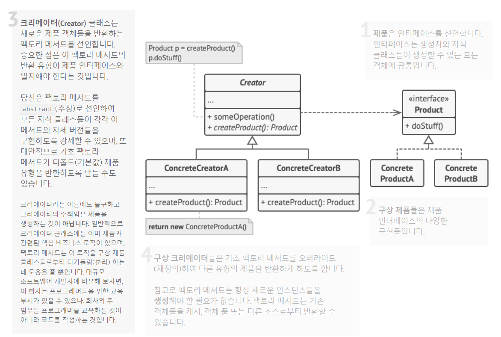

# 팩토리 메서드 패턴(Factory Method pattern)

객체 생성 디자인 패턴 입니다.

Simple Factory 패턴은 객체 생성 역할을 담당하면서 각 클라이언트에서 구현 클래스에 직접 의존하지 않도록 분리 했습니다.

하지만 새로운 클래스가 추가 되면 Factory 클래스를 수정해야 한다는 한계가 있습니다.

**기존 코드의 변경 없이 확장하기 위한 디자인 패턴**이 팩토리 메서드 패턴 입니다.

### 구조



팩토리 메서드 패턴은 객체를 생성 할 때 어떤 클래스의 인스턴스를 만들지 서브 클래스에서 결정하게 합니다.

부모 추상 클래스는 인터페이스에만 의존하고 실제로 어떤 구현 클래스를 호출 할 지는 서브 클래스에서 구현 합니다.

이렇게 하면 새로운 구현 클래스가 추가 되어도 기존 Factory 코드의 수정 없 이 새로운 Factory를 추가하면 됩니다.

### 장단점

* 장점 : 수정에 닫혀 있고 확장에 열려있는 OCP 원칙을 지킬 수 있습니다.
* 단점 : 간단한 기능을 사용할 때보다 많은 클래스를 정의해야 하기 때문에 코드량이 증가합니다.

### 샘플 코드

* `Button` 인터페이스 정의 (**Product**)

```java
public interface Button {
    void render();
    void onClick();
}
```

* `Button` 인터페이스를 구현한 `HTMLButton` 클래스 정의 (**Product**)

```java
public class HTMLButton implements Button {
    @Override
    public void render() {
        System.out.println("HTMLButton.render");
    }

    @Override
    public void onClick() {
        System.out.println("HTMLButton.onClick");
    }
}
```

* `Dialog` 추상클래스 정의(**Creator**)

```java
public abstract class Dialog {
    abstract Button createButton();

    public void render() {
        Button button = createButton();

        button.onClick();
        button.render();
    }
}
```

외부에서 `Button` 객체를 생성 할 때 `createButton()` 메서드를 호출하면 되고, 실제로 어떤 객체를 생성 할지는 추상 메서드를 `extends` 한 하위 클래스에서 정의 합니다.

* `WebDialog` 정의 (`Dialog` 상속) (**Creator**)

```java
public class WebDialog extends Dialog {
    @Override
    Button createButton() {
        return new HTMLButton();
    }
}
```

* Client

```java
private Dialog dialog = new WebDialog();
dialog.render();
```

`WebDialog` Creator를 사용함으로써 `HTMLButton` 의 객체를 생성하고 `onClick()`,`render()` 메서드를 수행하게 됩니다.

#### 스펙 확장

만약에 `WebDialog`만 사용하다가 `WindowsDialog`가 추가 되는 경우가 발생 합니다.

* `Button` 인터페이스를 구현한 `WindowsButton` 클래스 정의(**Product**)

```java
public class WindowsButton implements Button {
    @Override
    public void render() {
        System.out.println("WindowsButton.render");
    }

    @Override
    public void onClick() {
        System.out.println("WindowsButton.onClick");
    }
}
```

* `WindowsDialog` 정의 (`Dialog` 상속) (**Creator**)

```java
public class WindowsDialog extends Dialog {
    @Override
    Button createButton() {
        return new WindowsButton();
    }
}
```

* Client

```java
private Dialog dialog = new WindowsDialog();
dialog.render();
```

이처럼 기존 코드 변경 없이 새로 선언한 클래스만 사용하여 확장이 가능합니다.