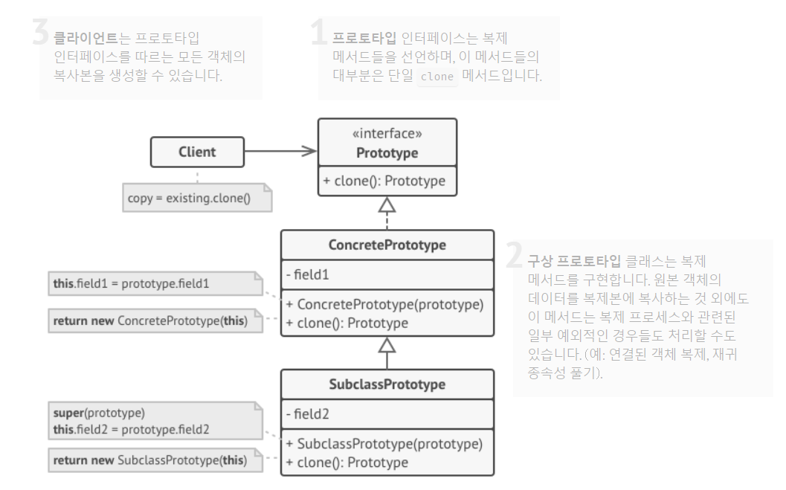

# 프로토타입 패턴(Prototype Pattern)

* **객체 생성**에 관한 디자인 패턴 중 하나 입니다.

* 객체를 생성하는 과정에서 발생하는 비용이나 시간을 줄이기 위해 사용됩니다.
* 프로토타입 패턴은 기존에 만들어진 객체(원형 객체)를 복제하여 새로운 객체를 생성하는 방식으로 작동합니다.
  * 즉, 복제를 통해 새로운 객체를 만들기 때문에 객체 생성에 필요한 비용이나 시간을 줄일 수 있습니다.
  * 객체 생성에 대한 중복 코드도 제거할 수 있습니다.

### 구조



### 샘플

##### 공통 모양 Interface

```java
public abstract class Shape {
    public int x;
    public int y;
    public String color;

    public Shape() {}

    public Shape(Shape shape) {
        if(shape != null) {
            this.x = shape.x;
            this.y = shape.y;
            this.color = shape.color;
        }
    }

    public abstract Shape clone();

    @Override
    public boolean equals(Object o) {
        if (this == o) {
            return true;
        }
        if (o == null || getClass() != o.getClass()) {
            return false;
        }
        Shape shape = (Shape) o;
        return x == shape.x && y == shape.y && color.equals(shape.color);
    }

    @Override
    public int hashCode() {
        return Objects.hash(x, y, color);
    }
}
```

##### 원 모양

```java
public class Circle extends Shape{

    public int radius;

    public Circle() {}

    public Circle(Circle circle) {
        super(circle);
        if(circle != null) {
            this.radius = circle.radius;
        }
    }

    @Override
    public Shape clone() {
        return new Circle(this);
    }

    @Override
    public boolean equals(Object o) {
        if (this == o) {
            return true;
        }
        if (o == null || getClass() != o.getClass()) {
            return false;
        }
        if (!super.equals(o)) {
            return false;
        }
        Circle circle = (Circle) o;
        return radius == circle.radius;
    }

    @Override
    public int hashCode() {
        return Objects.hash(super.hashCode(), radius);
    }
}
```

##### 직사각형 모양

```java
public class Rectangle extends Shape {

    public int width;
    public int height;

    public Rectangle() {}

    public Rectangle(Rectangle rectangle) {
        super(rectangle);
        if(rectangle != null) {
            this.width = rectangle.width;
            this.height = rectangle.height;
        }
    }

    @Override
    public Shape clone() {
        return new Rectangle(this);
    }

    @Override
    public boolean equals(Object o) {
        if (this == o) {
            return true;
        }
        if (o == null || getClass() != o.getClass()) {
            return false;
        }
        if (!super.equals(o)) {
            return false;
        }
        Rectangle rectangle = (Rectangle) o;
        return width == rectangle.width && height == rectangle.height;
    }

    @Override
    public int hashCode() {
        return Objects.hash(super.hashCode(), width, height);
    }
}
```

##### Client

```java
public class PrototypeTest {

    @Test
    public void test() {
        ArrayList<Shape> shapes = new ArrayList<>();
        ArrayList<Shape> shapesCopy = new ArrayList<>();

        Circle circle = new Circle();
        circle.x = 5;
        circle.y = 10;
        circle.radius = 15;
        circle.color = "green";
        shapes.add(circle);

        Circle anotherCircle = (Circle) circle.clone();
        shapes.add(anotherCircle);

        Rectangle rectangle = new Rectangle();
        rectangle.width = 10;
        rectangle.height = 20;
        rectangle.color = "blue";
        shapes.add(rectangle);

        for(Shape shape : shapes) {
            shapesCopy.add(shape.clone());
        }

        for (int i = 0; i < shapes.size(); i++) {
            System.out.println("[[[equals["+i +"] = "+ shapes.get(i).equals(shapesCopy.get(i)));
        }
    }
}
```

