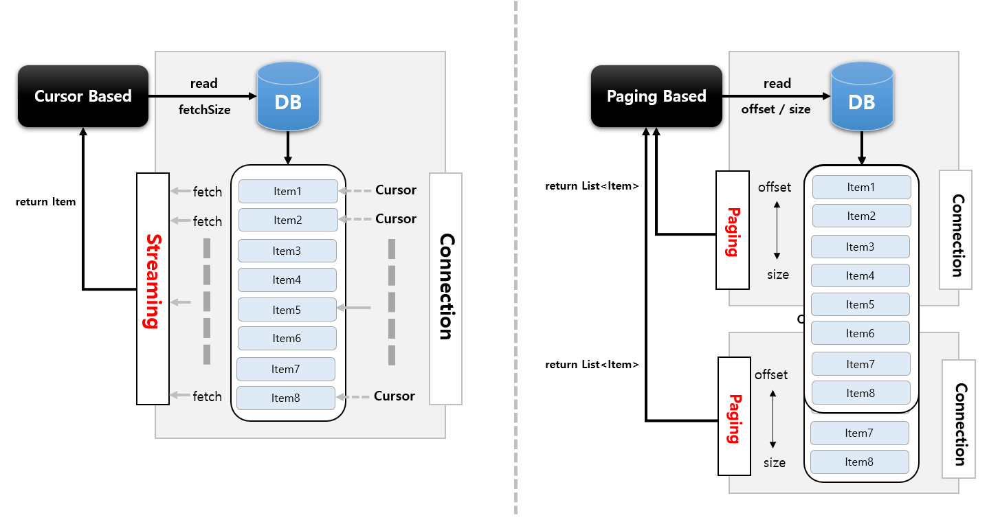

# [DB Reader] Cursor-based vs Paging-based

## Cursor-Based

* JDBC ResultSet의 기본 메커니즘을 사용.
* 현재 행에 커서를 유지하며 다음 데이터를 호출하면 다음 행으로 커서를 이동하며 데이터 반환이 이루어지는 Streaming 방식의 I/O.
* `ResultSet`이 Open될 때마다 `next()` 메소드가 호출 되어 Database의 데이터가 반환되고 객체와 매핑이 이루어짐.
* DB Connection이 연결되면 배치 처리가 완료될 때 까지 데이터를 읽어오기 때문에 DB와 SocketTimeout을 충분히 큰 값으로 설정 필요.
* 모든 결과를 메모리에 할당하기 때문에 메모리 사용량이 많아지는 단점.
* Connection 연결 유지 시간과 메모리 공간이 충분하다면 대량의 데이터 처리에 적합.(fetch size 조절)

## Paging-Based

* 페이징 단위로 데이터를 조회하는 방식으로 Page Size만큼 한 번에 메모리로 가지고 온 다음 한 개씩 읽음.
* 한 페이지를 읽을때마다 Connection을 맺고 끊기 때문에 대량의 데이터를 처리하더라도 SocketTimeout 예외가 거의 일어나지 않음.
* 시작 행 번호를 지정하고 페이지에 반환시키고자 하는 행의 수를 지정한 후 사용 - Offset, Limet
* 페이징 단위의 결과만 메모리에 할당하기 때문에 메모리 사용량이 적어지는 장점.
* Connection 연결 유지 시간이 길지 않고 메모리 공간을 효율적으로 사용해야 하는 데이터 처리에 적합.

### 흐름도

