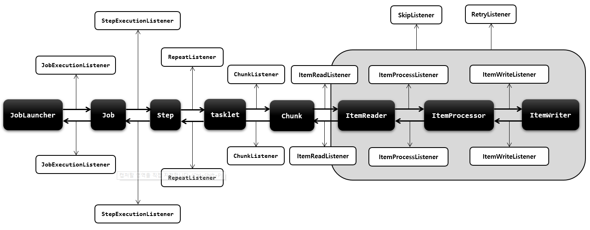

# [Spring Batch] 이벤트 리스너

* Listener는 배치 흐름 중에 Job, Step, Chunk 단계의 실행 전후에 발생하는 이벤트를 받아 용도에 맞게 활용할 수 있도록 제공하는 인터셉터 개념의 클래스
* 각 단계별로 로그 기록을 남기거나 소요된 시간을 계산하거나 실행상태 정보들을 참조 및 조회 할 수있다.
* 이벤트를 받기 위해서는 Listener를 등록해야 하며 등록은 API 설정에서 각 단계별로 지정 할 수 있다.

#### Listeners

- Job
  - JobExecutionListener : Job 실행 전후
- Step
  - StepExecutionListener : Step 실행 전후
  - ChunkListener : Chunk 실행 전후(Tasklet 실행 전후), 오류 시점
  - ItemReadListener : ItemReader 실행 전후, item이 null일 경우 호출 안됨
  - ItemProcessListener : ItemProcessor 실행 전후, item이 null일 경우 호출 안됨
  - ItemWriteListener : ItemWriter 실행 전후, 오류 시점, item이 null일 경우 호출 안됨
- SkipListener : 읽기, 쓰기, 처리 Skip실행 시점, item 처리가 Skip 될 경우 해당 item을 추적함
- RetryListener : Retry 시작, 종료, 에러 시점

#### 구현 방법

* 어노테이션 방식

```java
public class BatchStepExecutionListener {
    @BeforeStep
    public void beforeStep(StepExecution stepExecution) {
        System.out.println("BatchStepExecutionListener.beforeStep");
    }
    
    @AfterStep
    public void afterStep(StepExecution stepExecution) {
        System.out.println("BatchStepExecutionListener.afterStep");
        return ExitStatus.COMPLETED;
    }
}
```

* 인터페이스 방식

```java
public class BatchStepExecutionListener implements StepExecutionListener {
    @Override
    public void beforeStep(StepExecution stepExecution) {
        System.out.println("BatchStepExecutionListener.beforeStep");
    }
    
    @Override
    public void afterStep(StepExecution stepExecution) {
        System.out.println("BatchStepExecutionListener.afterStep");
        return ExitStatus.COMPLETED;
    }
}
```

