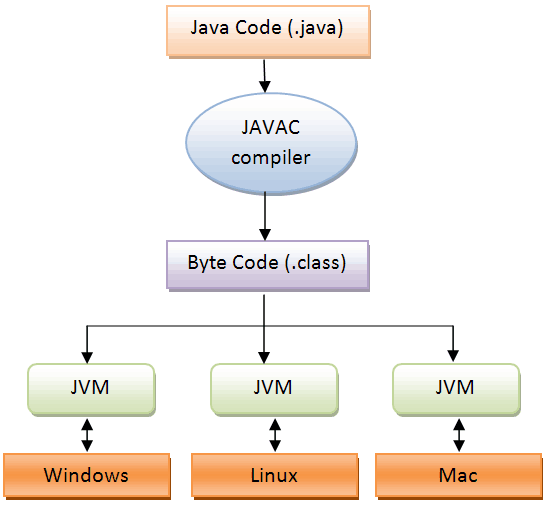

# JVM 구조

* Java Virtual Machine의 약자로, 자바 가상 머신
* 자바와 운영체제 사이에서 중개자 역할을 수행하며, 자바가 운영체제에 구애 받지 않고 프로그램을 실행할 수 있도록 도움
* 가비지 컬렉터를 사용한 메모리 관리도 자동으로 수행하며, 다른 하드웨어와 다르게 레지스터 기반이 아닌 스택 기반으로 동작

## JVM 메모리 구조

#### Class Loader

JVM 내로 클래스 파일을 로드하고, 링크를 통해 배치하는 작업을 수행하는 모듈

#### Execution Engine

Class Loader를 통해 JVM 내의 Runtime Data Area에 배치된 바이트 코드들을 명렁어 단위로 읽어서 실행

 #### Garbage Collector

힙 메모리 영역에 생성된 객체들 중에서 참조되지 않은 객체들을 탐색 후 제거하는 역할

 #### Runtime Data Area

JVM의 메모리 영역으로 자바 애플리케이션을 실행할 때 사용되는 데이터들을 적재하는 영역

* **Method area** 

  모든 쓰레드가 공유하는 메모리 영역

  메소드 영역은 클래스, 인터페이스, 메소드, 필드, Static 변수 등의 바이트 코드를 보관

* **Heap area**

  모든 쓰레드가 공유하며, new 키워드로 생성된 객체와 배열이 생성되는 영역

  메소드 영역에 로드된 클래스만 생성이 가능

  Garbage Collector가 참조되지 않는 메모리를 확인하고 제거하는 영역

* **Stack area** 

  메서드 호출 시마다 각각의 스택 프레임(그 메서드만을 위한 공간) 생성

  기본형 데이터나 호출된 메서드의 매개변수, 지역변수, 리턴 값 및 연산 시 일어나는 값들을 임시로 저장

  메서드 수행이 끝나면 프레임별로 삭제됨

* **PC Register**

  쓰레드가 시작될 때 생성되며, 생성될 때마다 생성되는 공간으로 쓰레드마다 하나씩 존재

  쓰레드가 어떤 부분을 무슨 명령으로 실행해야할 지에 대한 기록을 하는 부분

* **Native method stack**

  자바 외 언어로 작성된 네이티브 코드를 위한 메모리 영역

 

 

 

 

 

참조 : https://steady-coding.tistory.com/305