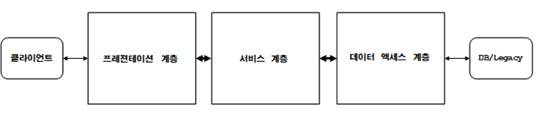

# Spring 3계층

관심, 책임, 성격 등이 서로 다른 것들을 분리하면 각 요소의 응집도가 높아지고 결합도는 낮아집니다. 만약 서로 다른 모듈을 분리하지 않으면 1가지 변경 사항에 대해 다른 요소들까지 영향을 받게 됩니다. 이러한 문제를 해결하고자 Spring은 요청을 처리하기 위한 계층을 3가지로 나누었습니다.

* **Presentation Layer(프레젠테이션 계층)** : 웹 기반으로 요청과 응답을 처리하는 계층
* **Service Layer(서비스 계층)** : 비즈니스 로직을 담고 있는 계층
* **Data Access Layer(데이터 접근 계층)** : DB와 연동되어 데이터에 접근하는 계층

 

### Presentation Layer(프레젠테이션 계층)

프레젠테이션 계층에서는 클라이언트로부터 HTTP 요청을 수신하고 그에 맞는 응답을 돌려주는 계층 입니다.

프레젠테이션 계층에서는 어떤 요청을 받고, 어떤 응답 상태와 데이터를 반환하는지에 대한 책임이 있습니다.

우리가 작성한 클래스를 프레젠테이션 계층으로 명시하기 위해서는 @Controller, @RestController 어노테이션을 사용해줘야 합니다. 그리고 Spring은 요청을 수신하기 위해 Restful API에 맞는 Mapping 어노테이션을 제공하고 있습니다.

> @GetMapping, @PostMapping, @PutMapping, @DeleteMapping ...

### Service Layer(서비스 계층)

서비스 계층에서는 요구 사항에 맞게 비즈니스 로직을 작성하는 계층입니다. 그렇기 때문에 일반적으로 서비스의 핵심 로직들이 주로 담겨 있습니다. 우리가 작성한 클래스를 서비스 계층으로 명시하기 위해서는 @Service 어노테이션을 사용해줘야 합니다.

또한 트랜잭션에 대한 관리 역시 서비스 계층에서 처리하는 것이 일반적인 패턴입니다.

### Data Access Layer(데이터 접근 계층)

데이터 접근 계층은 데이터를 저장하거나 조회하기 위해 DB에 접근하는 계층입니다. 우리가 작성한 클래스를 데이터 접근 계층으로 명시하기 위해서는 @Repository 어노테이션을 사용해줘야 합니다. 그러면 Spring은 @Repository가 붙은 어노테이션을 빈으로 등록하며, 추가적으로 에러 추상화와 같은 부가적인 기능을 제공해줍니다.