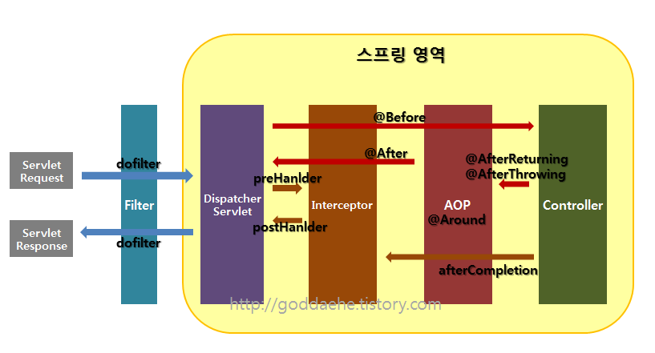

# servlet.Filter

필터는 스프링이 지원하는 기능이 아닌, J2EE 표준 스펙에 있는 기능으로, 가장 앞단에 존재하는 프론트 컨트롤러인 디스패처 서블릿에 요청이 전/후에 부가적인 작업을 처리할 수 있는 기능을 제공한다.



필터는 주로 @WebFilter 애노테이션을 사용해서 등록할 수 있고, 스프링 시큐리티(Spring Security)에서는 필터를 조립해서 계층적으로 구현할 수도 있다.

### 필터의 메소드

#### init

init 메소드는 필터 객체를 초기화하고 서비스에 추가하기 위한 메소드이다. 

웹 컨테이너가 1회 init 메소드를 호출하여 필터 객체를 초기화하면 이후의 요청들은 doFilter를 통해 처리된다.

####  doFilter

doFilter 메소드는 url-pattern에 맞는 모든 HTTP 요청이 디스패처 서블릿으로 전달되기 전에 웹 컨테이너에 의해 실행되는 메소드이다. 

doFilter의 파라미터로는 FilterChain이 있는데, FilterChain의 doFilter 통해 다음 대상으로 요청을 전달하게 된다. 

chain.doFilter() 전/후에 우리가 필요한 처리 과정을 넣어줌으로써 원하는 처리를 진행할 수 있다.

#### destroy

destroy 메소드는 필터 객체를 서비스에서 제거하고 사용하는 자원을 반환하기 위한 메소드이다. 

이는 웹 컨테이너에 의해 1번 호출되며 이후에는 이제 doFilter에 의해 처리되지 않는다.


```java
public class MyFilter implements Filter {

    @Override
    public void init(FilterConfig filterConfig) throws ServletException {
        System.out.println("[[[MyFilter.init");
        Filter.super.init(filterConfig);
    }

    @Override
    public void doFilter(ServletRequest request, ServletResponse response, FilterChain chain) throws IOException, ServletException {
        System.out.println("[[[MyFilter.doFilter1");

        chain.doFilter(request, response);

        System.out.println("[[[MyFilter.doFilter2");
    }

    @Override
    public void destroy() {
        System.out.println("[[[MyFilter.destroy");
        Filter.super.destroy();
    }
}
```

