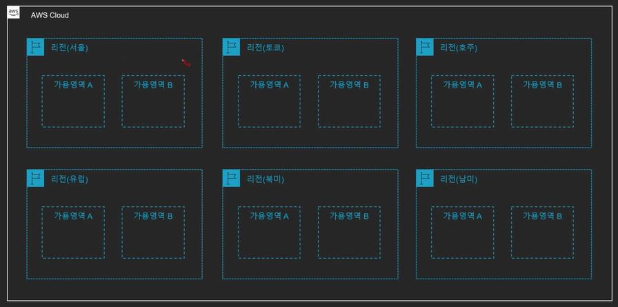
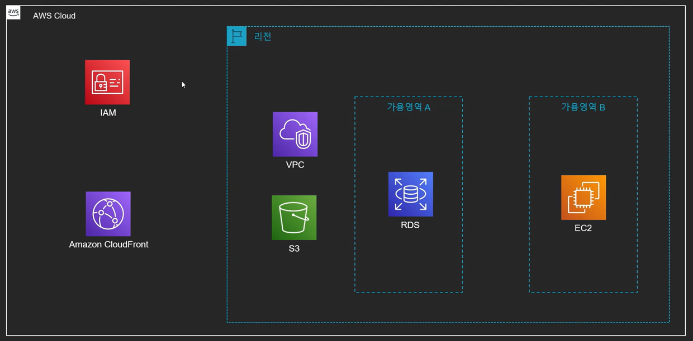
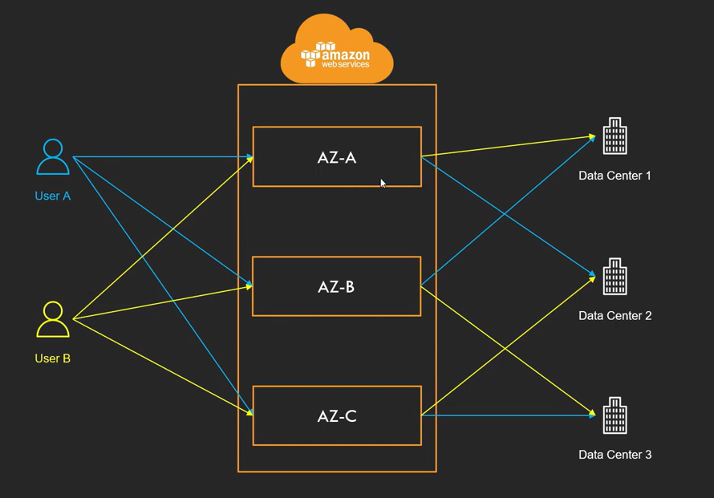

# AWS 구조

 

### 리전(Region)

* AWS의 서비스가 제공되는 서버의 물리적 위치
* 전 세계에 흩어져 있으며 큰 부분(동남아, 유럽, 북아메리카 등)으로 묶여 있음
* 각 리전에는 고유의 코드가 부여
  * 예시 : 서울 리전은 ap-northeast-2
  * 예시2 : 미국 동부(버지니아 북부) 리전은 us-east-1 [가장 처음 서비스가 출시되는 리전]
* 리전별로 가능한 서비스가 다름
* 리전을 선택할 때 고려 사항
  * 지연 속도
  * 법률(데이터, 서비스 제공 관련)
  * 사용 가능한 AWS 서비스

 

### 가용영역(Availability Zone)

* 리전의 하부 단위 (간단히 데이터 센터 건물로 봐도 됨)
  * 하나의 리전은 반드시 2개 이상의 가용영역으로 구성
* 하나 이상의 데이터 센터로 구성
* 리전 간의 연결은 매우 빠른 전용 네트워크로 연결
* 반드시 물리적으로 일정 거리 떨어져 있음
  * 다만 모든 AZ는 서로 100Km 이내의 거리에 위치
  * 여러 재해에 대한 대비 및 보완
* 각 계정별로 AZ의 코드와 실제 위치는 다름
  * 예 : 계정 Test1의 AZ-A는 계정 Test2의 AZ-A와 다른 위치(랜덤)
  * 보안 및 한 AZ로 몰림 방지

 

### 엣지 로케이션

* AWS의 CloudFront 등의 여러 서비스들을 가장 빠른 속도로 제공(캐싱)하기 위한 거점
* 전 세계에 여러 장소에 흩어져 있음

 

### 글로벌 서비스와 리전 서비스

* 서비스가 제공되는 지역의 기반에 따라 글로벌서비스와 리전 서비스로 분류
* 글로벌 서비스 : 데이터 및 서비스를 전 세계의 모든 인프라가 공유
  * CloudFront
  * IAM
  * Route53
  * WAF
* 지역 서비스 : 특정 리전을 기반으로 데이터 및 서비스 제공
  * 대부분의 서비스
  * S3
    * S3의 경우 전 세계에서 동일하게 사용할 수 있으나 데이터 자체는 리전에 종속

 

### ARN

* Amazon Resource Name : AWS의 모든 리소스의 고유 아이디
* 형식
  * arn:[partition]:[service]:[region]:[account_id]:[resource_type]/[resource_name]/(qualifier)
  * 예시
    * arn:aws:s3:::test_bucket/text.txt
    * arn:aws:dynamodb:ap-northeast-2:123456789012:table/mytable
    * arn:aws:dynamodb:ap-northeast-2:123456789012:table/*

* 맽 끝에 와일드카드(*) 사용 가능 - 다수의 리소스 지정