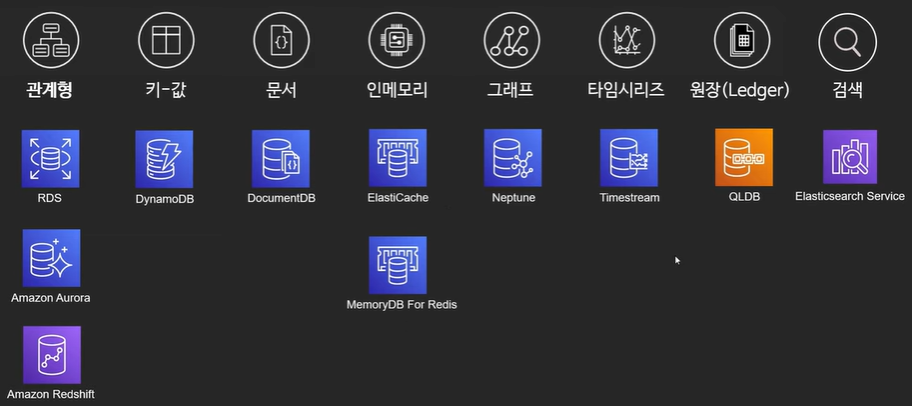
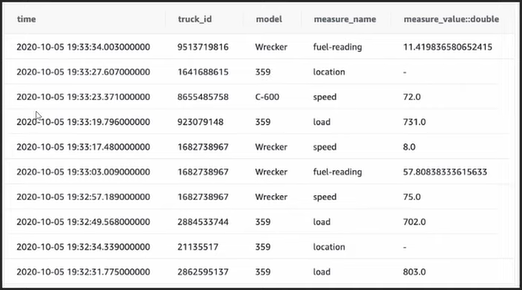

# AWS의 데이터베이스

## 관계형 DB

* 데이터의 관계에 집중한 DB
  * 사전에 정의된 관계가 있을 때 사용
  * 미리 지정된 형식과 타입의 데이터만 저장 가능
* 테이블의 형식으로 데이터를 관리
  * 행과 열을 기반으로 여러 테이블을 통해 데이터 정의
  * 고유의 키로 각 데이터를 식별
* 트렌젝션 지원
  * 원하는 동작이 정확히 수행되거나 완전히 실패, 둘 중 하나로 유지(All or Nothing)
  * 즉 어중간한 상태는 없음(일부만 반영되거나 하는 경우)
* 사용 사례 : 일반적인 어플리케이션, 온라인 게임 등

#### OLTP(Online Transactional Processing)

* 주로 데이터의 트렌젝션을 다루는 DB
* 예 : id 12345 번호를 가진 유저의 이름, 나이를 조회 혹은 값 수정

* 주로 관계형 DB에서 처리
* AWS 서비스 : **Amazon RDS**

#### OLAP(Online Analytical Processing)

* 데이터를 종합적으로 보고 통계를 산출하는데 특화된 DB
* 예 : 1월 한달 동안 서울에서 가장 많이 팔린 인형 종류를 조회

* 주로 데이터 웨어하우스에서 처리
* AWS 서비스 : **Amazon RedShift**

### 정리

* 기존에 사용하는 DB를 마이그레이션
  * **Amazon RDS**(MySQL, PostreSQL, Oracle, MS-SQL)
* 관계형 DB를 처음부터 사용 및 클라우드를 위한 설계 반영
  * **Amazon Aurora**
* 데이터 웨어하우스(OLAP)
  * **Amazon RedShift**

## 키-값 DB

* 데이터를 단순히 키-값으로 정의
  * 키를 고유한 식별자로 사용하는 키-값 쌍의 집합으로 데이터를 저장
  * 파티셔닝 가능
  * 다른 유형의 DB로는 불가능한 범위까지 수평 확장 가능
  * 키를 사용해서만 쿼리 가능

* 사용 사례
  * 세션 저장 : 유저의 로그인 이후 통신 중 인증에 사용되는 세션 저장
  * 장바구니 : 매우 많은 양의 데이터 및 상태 변경 처리 가능
* AWS 서비스 : **Amazon DynamoDB**

## 문서 DB

* 데이터를 JSON 혹은 유사 형식의 문서로 데이터를 저장 및 쿼리하는 DB
* 각 어플리케이션에서 사용하는 모델 형식을 그대로 사용 가능(예:JavaScript => JSON)
* Nest된 구조로 문서 저장 가능

* 사용 사례
  * 컨텐츠 관리 : 비디오 및 블로그 포스팅 등의 관리 및 추적
  * 카탈로그 : 제품의 카탈로그 저장
* AWS 서비스 : **Amazon DocumentDB**(MongoDB 호환)

## 그래프 DB

* 데이터보다 데이터 간의 관계가 더 중심인 DB
  * 각 데이터 주체간 관계와 연결을 분석하는데 최적화
* 사용 사례
  * 소셜 네트워크 : 각 사람간의 친구 관계, 팔로우 관계 등을 정의
  * 이상 탐지 : 구매자가 평소에 구매하지 않는 물품의 구매 등에 대한 감지 혹은 패턴 파악
  * 추천 엔진 : 누가 무엇을 구매했는지 혹은 어떤 그룹의 사람들이 어떤 성향을 가지고 있는지 파악

* AWS 서비스 : **Amazon Neptune**

## 인-메모리 DB

* 메모리를 사용한 DB
  * SSD 혹은 하드디스크에 저장하는 것이 아닌 메모리에 저장하기 때문에 매우 빠른 읽기/쓰기
  * 하드디스크/SSD에 비해 내구성 낮음
* 사용 사례
  * 실시간 경매 : 매우 빠른 IO 가 필요한 경매 시스템
  * 게임의 랭킹 보드 : 실시간으로 매우 빠르게 변하는 랭킹
  * 캐싱 : 자주 요청받는 메인 DB의 쿼리를 임시로 저장하여 빠른 속도로 유저에게 제공
* AWS 서비스 : **Amazon ElastiCache, Amazon MemoryDB for Redis**
  * ElastiCache : 메인 데이터베이스의 워크로드를 분산하고 캐싱 기능으로 활용
    * 사용 사례 : 쿼리 캐싱, 세션 저장, 임시 데이터 저장 등
  * MemoryDB : 메모리 데이터베이스로 메인 데이터베이스 자체로 사용을 상정
    * 사용 사례 : 타임시리즈 데이터베이스, IOT 기기들의 메인 데이터베이스 등

## 검색 DB

* 데이터의 검색에 특화된 DB
  * 인덱싱과 카테고리 기능에 특화
  * 원하는 데이터를 빠르게 찾는것이 목표
  * 주로 저장을 위한 DB 이외의 특별한 목적으로 사용
* 사용 사례
  * 컨텐츠 검색 : 로그 검색, 유저 정보 검색, 색인 등
  * 로그 분석 : 방대한 로그에서 원하는 조건에 맞는 로그 검색 혹은 시각화
* AWS 서비스 : **Amazon OpenSearch Service**

## 원장 DB

* 데이터의 신뢰성 및 투명성이 중요한 DB

  * 장부

  * 데이터의 정확한 변경 내역 및 무결성 확보가 중요한 기능

* 블록체인 네트워크 및 암호화를 통해 무결성 확보

* 사용 사례

  * 금융 거래 기록 : 변경되면 안되는 매우 중요한 이벤트 기록 및 감사

* AWS 서비스 : **Amazon QLDB**(Quantum Ledger Database)

## 타임시리즈 DB

* 많은 이벤트를 시간 단위로 저장하기 위한 DB
  * 수만~수십만건의 이벤트 데이터를 시간에 따라 정렬하고 특정 시점의 이벤트를 쿼리
  * 많은 IO가 발생
* 사용 사례
  * IOT 기기의 이벤트 관리 : 많은 숫자의 IOT 기기의 이벤트 기록 및 분석
  * 분석 어플리케이션 : 게임 같은 이벤트가 많이 발생하는 어플리케이션의 분석 데이터의 캐싱 및 시각화
* AWS 서비스 : **Amazon Timestream**

