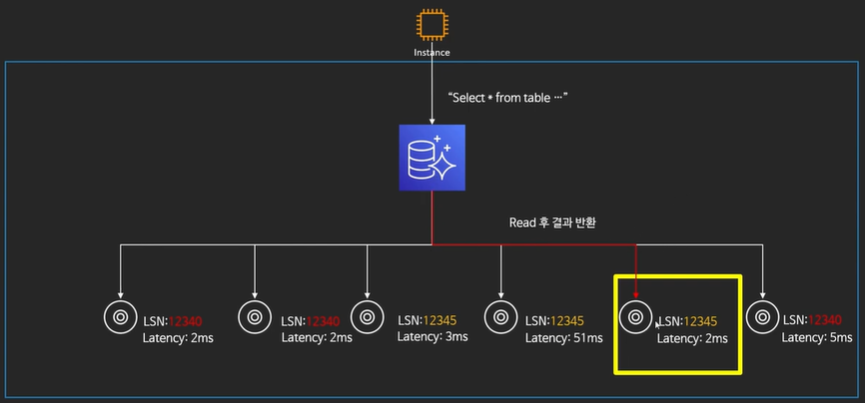

# Aurora

고성능 상용 데이터베이스의 성능과 가용성에 오픈 소스 데이터베이스의 간편성과 비용 효율성을 결합하였으며 클라우드를 위해 구축된 MySQL 및 PostgreSQL 호환 관계형 데이터베이스.

* MySQL / PostgreSQL 지원
* 두 가지 모드
  * **Single-Master** : 한개의 쓰기 전용 노드와 다수의 읽기 전용 노드 구성
  * **Multi-Master** : 다수의 노드로 읽기 쓰기가 가능

* 용량의 자동 증감 : 10GB부터 시작하여 10GB단위로 용량 증가 (최대 128TB)
* 연산 능력 : 96v CPU와 768GB까지 증가 가능 (db.r5.24xlarge)
* 데이터의 분산 저장 : 각 AZ마다 2개의 데이터 복제본 저장 * 최소 3개 이상의 AZ = 최소 6개의 복제본
  * 3개 이상을 잃어버리기 전엔 쓰기 능력 유지
  * 4개 이상을 잃어버리기 전엔 읽기 능력 유지
  * 손실된 복제본은 자가 치유 : 지속적으로 손실된 부분을 검사 후 복구
  * Quorum 모델 사용
    * 읽기 혹은 쓰기를 분산 노드 중 일부분에서만 수행
    * Quorum : 분산 시스템에서 트랜잭션을 수행하기 위해서 각 분산 노드로부터 확보해야하는 최소한의 투표수
    * 읽기 쿼럼과 쓰기 쿼럼은 적어도 하나 이상의 노드가 겹쳐야 함
    * 쓰기를 완료하려면 이번에 사용할 쓰기 쿼럼과 이전에 쓰기를 완료한 쓰기 쿼럼이 겹쳐야 함

## Single-Master 모드

* 한대의 Writer 인스턴스와 다수의 읽기 전용 인스턴스(Aurora Replicas)로 구성
* 총 15개의 Replica 생성 가능
* Async 복제
* 하나의 리전 안에 생성 가능
* Writer가 죽을 경우 자동으로 Replica 중 하나가 Writer로 Failover
  * 데이터 손실 없이 Failover시 메인으로 승격 가능
* 고가용성을 확보

## Multi-Master 모드

* 최대 4개의 노드가 읽기/쓰기 담당
  * 각 노드는 독립적 : 정지/재부팅/삭제 등에 서로 영향 받지 않음
* 지속적인 가용성 제공
* 주로 Multitenant 혹은 Sharding이 적용된 어플리케이션에 좋은 성능

## Aurora Global Database

* 전 세계의 모든 리전에서 1초내의 지연시간으로 데이터 엑세스 가능
* 재해복구용으로도 활용 가능
  * 유사시 보조 리전 중 하나를 승격하여 메인으로 활용
  * 1초의 RPO(복구 목표 지점)
  * 1분 미만의 RTO(복구 목표 시간)
* 보조 리전에는 총 16개의 Read 전용 노드 생성 가능

## 병렬 쿼리

* 다수의 읽기 노드를 통해 쿼리를 병렬로 처리하는 모드
  * 빠름
  * 부하 분산(CPU, Memory)
* MySQL 5.6/5.7에서만 지원
* 몇몇 낮은 인스턴스에서는 지원하지 않음

## Aurora의 백업

* 읽기 복제본(Read Replica) 지원 : Aurora Replica와 다른 개념
  * MySQL DB의 Binary log 복제
  * **단 다른 리전에만 생성 가능**
* RDS와 마찬가지로 자동/수동 백업 가능
  * 자동 백업의 경우 1~35일 동안 보관 (S3에 보관)
  * 수동 백업(스냅샷) 가능
  * 백업 데이터를 복원할 경우 다른 데이터베이스를 생성

## Aurora DB 클로닝

* 기존의 DB에서 새로운 DB를 복제
  * 스냅샷을 통해 새로운 DB를 생성하는 것 보다 빠르고 저렴
* Copy-On-Write 프로토콜 사용
  * 리소스가 복제되었지만 수정되지 않은 경우에 새 리소스를 만들 필요 없이 복사본과 원본이 리소스를 공유하고, 복사본이 수정되었을 때만 새 리소스를 만드는 리소스 관리 기법

## Backtrack

* 기존의 DB를 특정 시점으로 되돌리는 것 (새로운 DB가 아닌 기존 DB)
  * DB관리의 실수를 쉽게 만회 가능
    * 예 : where 없는 delete
  * 새로운 DB를 생성하는 것보다 훨씬 빠름
  * 앞 뒤로 시점을 이동 할 수 있기 때문에 원하는 지점을 빠르게 찾을 수 있음
* Backtrack Window
  * Target Backtrack Window
    * 어느 시점 만큼 DB를 되돌리기 위한 데이터를 저장 할 것인지
    * 지정 시점 이전으로는 Backtrack 불가능
  * Actual Backtrack Window
    * 실제로 시간을 얼마나 되돌리지
    * Target Backtrack Window보다 작아야 함
* Backtrack 활성화시 시간당 DB의 변화를 저장
  * 저장된 용량만큼 비용 지불
  * DB 변화가 많을수록 많은 로그 = 많은 비용
  * DB로그가 너무 많아 Actual Backtrack Wondow가 Target Backtrack Window보다 작을 경우, 알림
* MySQL만 가능
* Aurora 생성시 Backtrack을 설정한 DB만 사용 가능
  * 스냅샷을 복구하거나 Clone을 통해 기능 활성화 가능
* Multi-Master 상태에서는 Backtrack 불가능

## Aurora의 데이터 복구

* MTTF : 평균 고장 시간

* MTTR : 평균 수리 시간
  *  Aurora는 10GB 단위로 데이터 저장하여 복구하는 시간을 줄임

## Aurora가 효율적으로 읽기/쓰기를 처리하는 방법

* LSN(Log Sequence Number)
  * DB 로그 파일에서 특정 로그 파일의 위치 혹은 오프셋
  * 쓰여진 데이터 바이트만큼 추가
  * 각 쿼리(=로그파일) 별로 고유의 값 획득(계속 증가)
* 페이지 업데이트
  1. 스토리지 노드에서 LSN을 받아서 Data Page를 직접 업데이트
  2. 마지막 LSN 업데이트
  3. 업데이트 완료 선언
* 로그 레코드만 업데이트
  1. 스토리지 노드에서 LSN을 받고 업데이트 완료 선언
  2. Data Page 업데이트
  3. 마지막 LSN 업데이트

**Aurora에서 Write는 로그 레코드만 업데이트 하는 방식으로 속도를 빠르게 처리.**

**읽기가 온 시점에 따라서 어떤 LSN에 해당하는 읽기인지 보고 그보다 높은 LSN에 해당하는 스토리지 노드 중에서 Latency가 가장 낮은(빠른) 것에서 데이터를 조회**

