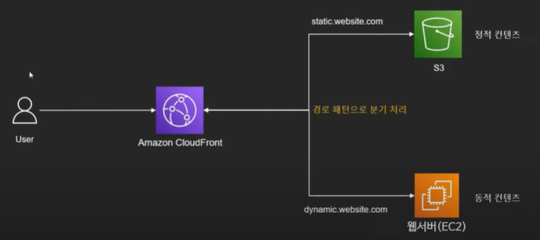
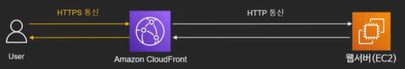
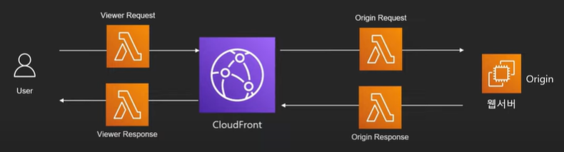

# CloudFront

개발자 친화적 환경에서 짧은 지연 시간과 빠른 전송 속도로 데이터, 동영상, 애플리케이션 및 API를 전 세계 고객에게 안전하게 전송하는 고속 콘텐츠 전송 네트워크(CDN) 서비스.

## CDN:Content Delivery Network

* 웹페이지, 이미지, 동영상 등의 컨텐츠를 본래 서버에서 받아와 캐싱
* 해당 컨텐츠에 대한 요청이 들어오면 캐싱해 둔 컨텐츠 제공
* 컨텐츠를 제공하는 서버와 실제 요청 지점간의 지리적 거리가 매우 먼 경우, 혹은 통신 환경이 안좋은 경우 요청 지점 근처의 CDN을 통해 빠르게 컨텐츠 제공 가능
* 서버로 요청이 필요 없기 때문에 서버의 부하를 낮추는 효과

**엣지 로케이션** : 컨텐츠가 캐싱되고 유저에게 제공되는 지점

## CloudFront 동작 방식

* 요청 받은 컨텐츠가 엣지 로케이션에 있다면, 바로 전달
* 요청 받은 컨텐츠가 엣지 로케이션에 없다면, 컨텐츠를 제공하는 근원에서 제공받아 전달

## CloudFront 구성

* Origin : 실제 컨텐츠가 존재하는 근원
  * AWS서비스(EC2, S3, ELB 등)
  * 온프레미스 서버
* Distribution : CloudFront의 CDN 구분 단위로 여러 엣지 로케이션으로 구성된 컨텐츠 제공 채널
* 주요 설정 및 용어
  * TTL(Time To Live) : 캐싱된 아이템이 살아 있는 시간 -> TTL 초 이후 캐싱에서 삭제
  * 파일 무효화(Invalidate) : TTL이 지나기 전에 강제로 캐시를 삭제하는 것
    * 주로 새로운 파일을 업데이트 한 후 TTL을 기다리지 못할 상황에 사용
    * 비용 발생
    * CloudFront API, 콘솔, Third-Party 툴 등을 사용 가능

* Cache Key
  * 어떤 기준으로 컨텐츠를 캐싱할 것인지 결정
  * 기본적으로 URL
  * 이후 Header와 Cookie, 쿼리 스트링 등을 사용 가능
* 정책(Policy)
  * CloudFront가 동작하는 방법을 정의
  * 어떻게 캐싱을 할지, 어떤 내용을 Origin에 보낼지, 어떤 헤더를 허용할 지 등을 결정

## CloudFront 기능

* CDN : 컨텐츠를 최적화하여 보다 빠르게 유저에게 제공
  * 정적/동적 컨텐츠 모두 최적화
    * 정적(Static) 컨텐츠 : 서버를 거치지 않고 클라이언트에서 직접 보여주는 내용
      * 이미지, CSS, 기타 서버가 필요 없는 내용들
    * 동적(Dynamic) 컨텐츠 : 서버 계산, DB 조회 등이 필요한 내용
      * 로그인, 게시판 등

* CloudFront 최적화 방식
  * 정적 컨텐츠 : 캐싱으로 접근 속도 최적화
  * 동적 컨텐츠 : 네트워크 최적화, 연결 유지, Gzip 압축 등을 사용
    * DNS Lookup, TCP Connection, Time to First Byte 등을 최적화

* HTTPS 지원
  * Origin에서 HTTPS를 지원하지 않더라도 HTTPS통신을 지원할 수 있도록 구성 가능

* 지리적 제한 : 특정 지역의 컨텐츠 접근을 제한 가능
* 다른 서비스와 연계
  * AWS WAF, Lambda@Edge 등과 연동 가능

## CloudFront와 연산 서비스

* Lambda@edge
  * 람다를 사용
  * 사용 사례
    * 예 : 한국에서 요청이 올 경우 한국 웹서버, 미국에서 올 경우 미국 웹 서버로 분산
    * 커스텀 에러 페이지
    * Cookie를 검사해 다른 페이지로 리다이렉팅 => A/B테스트
    * CloudFront에서 Origin에 도착 이전에 인증 등
* CloudFront Function
  * Lambda@edge의 1/6 비용으로 경량 javascript 실행
  * 사용사례 : 캐싱, 헤더 조작 등

**CloudFront_Lambda@edge와연동**

## CloudFront의 리포팅

* 주요 CloudFront 이용 지표 확인 가능
  * 캐시 상태
  * 가장 많이 요청 받은 컨텐츠
  * Top Referrer

## CloudFront의 정책

* 총 3가지 정책 설정 가능
  * Cache Control : 캐싱 방법 및 압축
    * TTL 및 Cache Key 정책
    * CloudFront가 어떻게 캐싱을 할 지 결정
  * Origin Request : Origin으로 어떤 내용을 보낼 것인가
    * Origin에 쿠키, 헤더, 쿼리스트링 중 어떤 것을 보낼 것인가
  * 뷰어에게 보낼 HTTP Header
    * CloudFront가 뷰어에게 응답과 같이 실어 보낼 HTTP Header

## CloudFront의 뷰어 정보 확인

* CloudFront에서 뷰어의 정보를 헤더에 더해 Origin에 전송
* 확인 가능한 뷰어의 정보
  * 디바이스 타입 : Android/IOS/SmartTV/Desktop
  * IP Address
  * Country/도시/위도 경도, 타임존 등

## CloudFront의 보안

* Signed URL : 어플리케이션에서 CloudFront의 컨텐츠에 접근 할 수 있는 URL을 제공하여 컨텐츠 제공을 제어
  * URL에는 시작시간, 종료시간, IP, 파일명, URL의 유효기간 등의 정보를 담을 수 있음
  * 이 URL 접근 이외의 접근을 막고 허용된 유저에게만 URL을 전달하여 컨텐츠 제공을 제어 가능
  * **단 하나의 파일 또는 컨텐츠에 대한 허용만 가능**
  * S3 Signed URL과 비슷한 방식
* Signed Cookie : 다수의 컨텐츠의 제공 방식을 제어하고 싶을 때 사용
  * Signed URL과 마찬가지로 여러 제약 사항 설정 가능
  * **다수의 파일 및 스트리밍 접근 허용 가능**
* Origin Access Identity
  * S3의 컨텐츠를 CloudFront를 사용해서만 볼 수 있도록 제한하는 방법
  * CloudFront만 권한을 가지고 S3에 접근하고 나머지 접근권한은 막음
  * S3 Bucket Policy로 CloudFront의 접근을 허용해야 사용 가능
* Field Level Encryption
  * CloudFront로 부터 Origin사이의 통신을 암호화
  * 최대 10개의 필드까지
  * 공개키 방식으로 암호화 -> CloudFront에 공개키를 제공 후 Origin에서 Private Key로 해독
