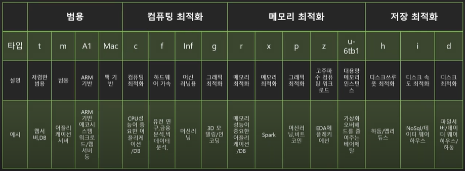
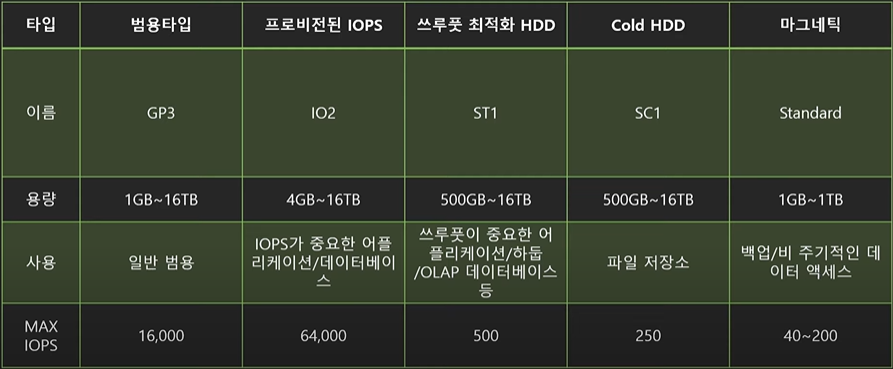
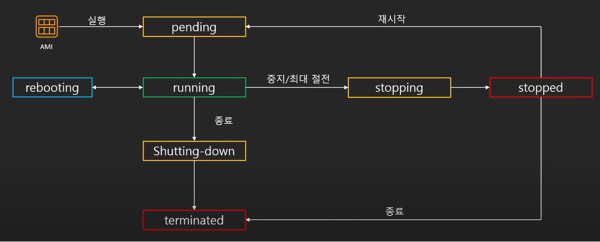
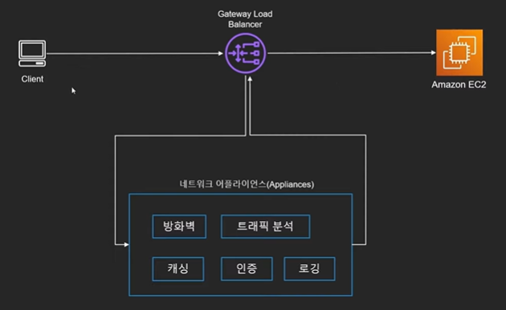
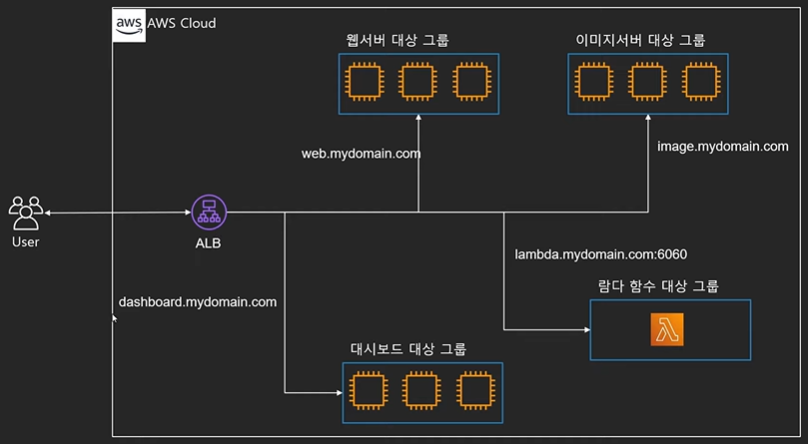
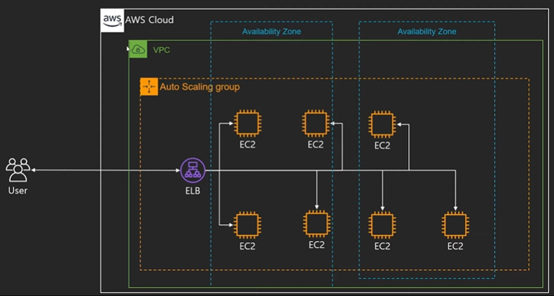

# EC2

Amazon Elastic Compute Cloud

안전하고 크기 조정이 가능한 컴퓨팅 파워를 클라우드에서 제공하는 웹 서비스

 

### EC2 사용 예

* 서버 구축
  * 게임서버, 웹서버, 어플리케이션 서버
* 어플리케이션 사용 및 호스팅
  * 데이터베이스
  * 머신 러닝
  * 비트코인 채굴
  * 연구용 프로그램
* 기타 다양한 목적
  * 그래픽 렌더링
  * 게임

 

### EC2 특성

* 초 단위 온디맨드 가격 모델
  * 가격이 초 단위로 결정
  * 서비스 요금을 미리 약정하거나 선입금 필요없음
* 빠른 구축 속도와 확장성
  * 몇 분이면 전 세계에 인스턴스 수백여대를 구축 가능
* 다양한 구성방법 지원
  * 머신러닝, 웹서버, 게임서버, 이미지처리 등 다양한 용도에 최적화된 서버 구성 가능
  * 다양한 과금 모델 사용 가능
* 여러 AWS 서비스와 연동
  * 오토스케일링, Elastic Load Balancer(ELB), CloudWatch

 

### EC2 구성

* 인스턴스 : 클라우드에서 사용하는 가상 서버로 CPU, 메모리, 그래픽카드 등 연산을 위한 하드웨어를 담당
* EBS : Elastic Block Storage : 클라우드에서 사용하는 가상 하드디스크
* AMI : EC2 인스턴스를 실행하기 위한 정보를 담고 있는 이미지
* 보안 그룹 : 가상의 방화벽

 

### 가격정책

* On-Demand
  * 실행하는 인스턴스에 따라 시간 또는 초당 컴퓨팅 파워로 측정된 가격 지불
  * 약정 필요 없음
  * 정기적인 수요 예측이 힘들거나 유연하게 EC2를 사용하고 싶을 때
  * 한번 써보고 싶을 때
* 예약 인스턴스(Reserved Instance- RI)
  * 미리 일정기간(1~3년) 약정해서 쓰는 방식
  * 최대 75%정도 저렴
  * 수요 예측이 확실할 때
  * 총 비용을 절감하기 위해 어느정도 기간의 약정이 가능한 사용자
* Spot Instance
  * 경매 형식으로 시장에 남는 인스턴스를 저렴하게 구매해서 쓰는 방식
    * 수요에 따라 스팟 인스턴스의 가격은 변동
    * 지정한 가격보다 현재 가격이 낮다면 사용
    * 지정한 가격보다 현재 가격이 높다면 반환
  * 최대 90%정도 저렴
  * 반환 시간 예측 불가능
    * 인스턴스가 확보되고 종료되는 것을 반복해도 문제 없는 분산 아키텍쳐 필요
  * 시작 종료가 자유롭거나 추가적인 컴퓨팅 파워가 필요한 경우
* 전용 호스트(Dedicated)
  * 실제 물리적인 서버를 임대하는 방식
  * 라이선스 이슈
  * 보안, 규정에 따라 필요한 경우
  * 퍼포먼스 이슈(CPU Steal 등)

##### 가격 순서

* 스팟 인스턴스 < 예약 인스턴스 < 온디맨드 < 전용 호스트

##### EC2의 가격모델은 EBS와는 별도

* EBS는 사용한 만큼 지불

##### 기타 데이터 통신 등의 비용은 별도로 청구

* AWS는 바깥으로 나가는 트래픽에 대해서만 요금 부과

 

### 인스턴스 유형

* 타입별로 이름 부여
  * 예 : t타입, m타입, inf타입 등
* 타입별 세대별로 숫자 부여
  * 예 : m5 = m인스턴스의 5번째 세대
* 아키텍쳐 및 사용 기술에 따라 접두사
  * 예 : t4g = t4 인스턴스 중 AWS Graviton 프로세서를 사용

### 인스턴스 크기

* 인스턴스의 cpu개수, 메모리 크기, 성능 등으로 사이즈 결정
* 크기가 클수록
  * 더 많은 메모리
  * 더 많은 cpu
  * 더 많은 네트워크 대역폭
  * EBS와의 통신 가능한 대역폭

 

## EBS

* Amazon Elastic Block Store

* EC2 인스턴스에서 사용할 영구 블록 스토리지 볼륨을 제공

* 가상 하드드라이브
* EC2 인스턴스와 네트워크로 연결되어 있음
  * 인스턴스 변경이 용이 (업그레이드, 다운그레이드 편함)
  * EBS 연결 및 변경이 용이 (여러개 연결 가능)
* EC2 인스턴스가 종료되어도 계속 유지 가능
* 인스턴스 정지 후 재 기동 가능
* 하나의 EBS를 여러 EC2 장착 가능(EBS Multi Attach)
* 루트 볼륨으로 사용시 EC2가 종료되면 같이 삭제됨 (인스턴스 스토리지)
  * 설정을 통해 EBS만 따로 존속 가능
* EC2와 같은 가용영역에 존재

#### EBS 종류

#### 스냅샷

* 특정 시간의 EBS 상태 저장본
  * EBS에 사진을 찍어둔 개념
* 필요시 스냅샷을 통해 특정 시간의 EBS로 복구 가능
* S3에 보관
  * 증분식 저장

 

### AMI (Amazon Machine Images)

* EC2 인스턴스를 실행하기 위해 필요한 정보를 모은 단위
  * OS, 아키텍쳐 타입, 저장공간 용량 등
* AMI를 사용하여 EC2를 복제하거나 다른 리전 -> 계정으로 전달 가능

* 스냅샷을 기반으로 AMI 구성 가능
* 구성
  * 1개 이상의 EBS 스냅샷
  * 인스턴스 저장 인스턴스의 경우 루트 볼륨에 대한 템플릿
  * 사용 권한 (어떤 AWS 계정이 사용할 수 있는지)
  * 블록 디바이스 맵핑 (EBS가 어떤 용량으로 몇개 붙는지)
* 총 두가지 타입
  * EBS기반 / 인스턴스 저장 기반
* 타입에 따른 AMI 생성 방법
  * EBS : 스냅샷을 기반으로 루트 디바이스 생성
  * 인스턴스 저장 : S3에 저장된 템플릿을 기반으로 생성

 

### EC2 생명 주기

* 중지

  * 중지 중에는 인스턴스 요금 미 청구

  * 단 EBS 요금, 다른 구성요소(Elastic IP 등)은 청구
  * 중지 후 재시작시 퍼블릭 IP 변경
  * EBS를 사용하는 인스턴스만 중지 가능 : 인스턴스 저장 인스턴스는 중지 불가

* 재부팅

  * 재부팅시에는 퍼블릭 IP 변동 없음

* 최대 절전모드

  * 메모리 내용을 보존해서 재시작시 중단지점에서 시작할 수 있는 정지모드

| 인스턴스 상태 | 설명                                         | 인스턴스 사용요금           |
| ------------- | -------------------------------------------- | --------------------------- |
| pending       | 인스턴스가 running 상태로 될 준비            | 미청구                      |
| running       | 인스턴스 사용 중                             | **청구**                    |
| stopping      | 인스턴스가 중지 또는 최대 절전모드로 전환 중 | 미청구, **최대절전시 청구** |
| stopped       | 인스턴스가 중지 상태 : 재시작 가능           | 미청구                      |
| shutting-down | 인스턴스가 종료 중                           | 미청구                      |
| terminated    | 인스턴스가 영구적으로 삭제됨                 | 미청구                      |

 

### Auto Scaling

애플리케이션을 모니터링하고 용량을 자동으로 조정하여, 최대한 저렴한 비용으로 안정적이고 예측 가능한 성능을 유지.

> Vertical Scale (Scale Up) : 기존의 서버를 보다 높은 사양으로 업그레이드
>
> Horizontal Scale (Scale Out) : 장비를 추가하여 확장하는 방식

EC2의 스케일링은 Scale Out 방식.

#### 목표

* 정확한 수의 EC2 인스턴스를 보유하도록 보장
  * 그룹의 최소/최대 인스턴스 숫자
    * 최소 숫자 이하로 내려가지 않도록 인스턴스 숫자를 유지(인스턴스 추가)
    * 최대 숫자 이상으로 늘어나지 않도록 인스턴스 숫자 유지(인스턴스 삭제)
  * 다양한 스케일링 정책 적용 가능
    * 예 : CPU의 부하에 따라 인스턴스 크기를 늘리기
* 가용 영역에 인스턴스가 골고루 분산될 수 있도록 인스턴스를 분배
  * 가용 영역에 장애 발생시 리스크 최소화

#### 구성

* 시작 구성(launch configurations) / 시작 템플릿(launch template)
  * EC2의 타입, 사이즈
  * AMI
  * 보안그룹, Key, IAM
  * 유저 데이터
* 모니터링
  * 예 : CPU 점유율이 일정 %를 넘어섰을 때 추가로 실행, 2개 이상 필요한 스택에서 EC2 하나가 죽었을 때
  * CloudWatch, ELB와 연계
* 설정
  * 최대/최소/원하는 인스턴스 수
  * ELB와 연동 등

| 무엇을                                                       | 언제     | 얼마나 어떻게 실행 시킬 것인가 |
| ------------------------------------------------------------ | -------- | ------------------------------ |
| 시작 구성 (launch configurations)  시작 템플릿 (launch template) | 모니터링 | 설정                           |

 

### ELB (Elastic Load Balancing)

* 다수의 서비스에 트래픽을 분산 시켜주는 서비스
* Health Check : 직접 트래픽을 발생시켜 Instance가 살아 있는지 체크
* Autoscling과 연동 가능
* 여러 가용영역에 분산 가능
* 지속적으로 IP주소가 바뀌며 IP 고정 불가능 : 항상 도메인 기반으로 사용
* 종류
  * Application Load Balancer
    * 똑똑한 녀석
    * 트래픽을 모니터링하여 라우팅 가능
      * 예 : image.sample.com -> 이미지 서버로, web.sample.com -> 웹 서버로 트래픽 분산
  * Network Load Balancer 
    * 빠른 녀석
    * TCP 기반 빠른 트래픽 분산
    * Elastic IP 할당 가능
  * Gateway Load Balancer
    * 먼저 트래픽 체크하는 녀석
    * 가상 어플라이언스 배포/확장 관리를 위한 서비스

#### 대상 그룹(Target Group)

* ALB(Application Load Balancer)가 라우팅 할 대상의 집합
* 구성
  * 3+1가지 종류
    * Instance
    * IP
    * Lambda
    * ALB
  * 프로토콜(HTTP, HTTPS, gRPC 등)
  * 기타 설정
    * 트래픽 분산 알고리즘, 고정 세션 등

#### 아키텍쳐

