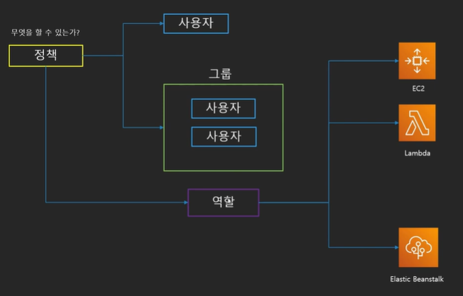
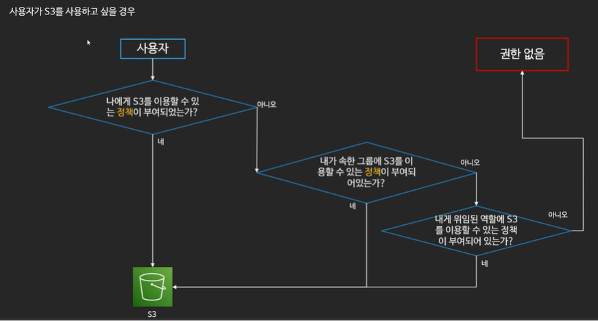
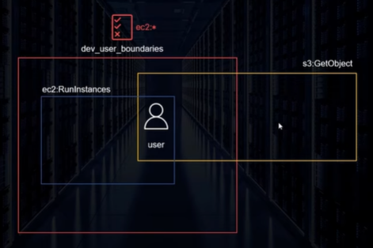
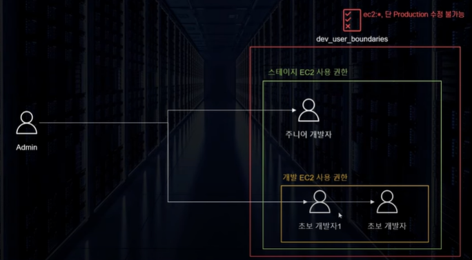

# IAM

### IAM 소개

* AWS 어카운트 관리 및 리소스/사용자/서비스의 권한 제어
  * 서비스 사용을 위한 인증 정보 부여
* 사용자의 생성 / 관리 및 계정의 보안
  * 사용자의 패스워드 정책관리(일정 시간마다 패스워드 변경 등)
* 다른 계정과의 리소스 공유
  * Identity Federation (Facebook 로그인, 구글 로그인 등)
* 계정에 별명 부여 가능 -> 로그인 주소 생성 가능
* IAM은 글로벌 서비스


### IAM 구성

* 사용자
  * 실제 AWS를 사용하는 사람, 어플리케이션 의미
* 그룹
  * 사용자의 집합
  * 그룹에 속한 사용자는 그룹에 부여된 권한을 행사
* 정책(Policy)
  * 사용자와 그룹, 역할이 무엇을 할 수 있는지에 관한 문서
  * JSON형식으로 정의
* 역할(Role)
  * AWS 리소스에 부여하여 AWS 리소스가 무엇을 할 수 있는지를 정의
  * 혹은 다른 사용자가 역할을 부여 받아 사용
  * 다른 자격에 대해서 신뢰관계를 구축 가능
  * 역할을 바꾸어 가며 서비스 사용 가능





### IAM의 권한 검증




### IAM 모범 사용 사례

* 루트 사용자는 사용하지 않기
* 불필요한 사용자 만들지 않기
* 가능하면 그룹과 정책을 사용하기
* 최소한의 권한만을 허용하는 습관 들이기
* MFA를 활성화 하기
* AccessKey 대신 역할을 활용하기
* IAM 자격 증명 보고서 활용하기

<br>

## 권한 범위 설정

#### 권한 범위(Permission Boundaries)

* IAM 자격증명(사용자, 역할)이 행사 가능한 **최대 권한**을 정의
  * 실제로 자격을 부여하지 않고 행사 할 수 있는 권한의 범위만 정의
* 자격 증명이 행사 할 수 있는 권한은 권한 범위와 실제 부여된 권한 중 겹치는 부분



1. 이미지를 보면 사용자가 ec2 를 실행할 수 있는 정책과 s3의 객체를 가져올 수 있는 정책을 가지고 있음.
2. 그러나 사용자는 dev_user_boundaries 권한 범위를 가지고 있음.
3. dev_user_boundaries 는 ec2 의 모든 권한이 가능함.
4. 사용자는 권한 범위와 정책이 겹치는 부분인 ec2 실행 권한만 행사가 가능.
5. s3 객체를 가져오는 것은 불가능(권한 범위에 s3는 없음)

#### 사용 예시

* Production 인프라 보호
  * 관리자가 주이너 이하 개발자 유저가 따라야 할 권한 범위 정책 생성
    * 권한범위 내용 : ec2:*, 단 Stage만 가능, Production인 경우 수정 불가
  * 유저 생성시 boundary 포함해서 부여



##### 정책 생성 JSON 샘플

```json
{
    "Version" : "2021-05-18",
    "Statement" : [
        {
            "Effect" : "Allow",
            "Action" : ["ec2:*"],
            "Resource" : "*"
        },
        {
            "Sid":"DenyEC2Production",
            "Effect" : "Deny",
            "Action" : "ec2:*",
            "Resource" : "arn:aws:ec2:*:*:instance/*",
            "Condition" : {
                "StringEquals" : {
                    "aws:ResourceTag/Stage" : "Production"
                }
            }
        }
    ]
}
```

