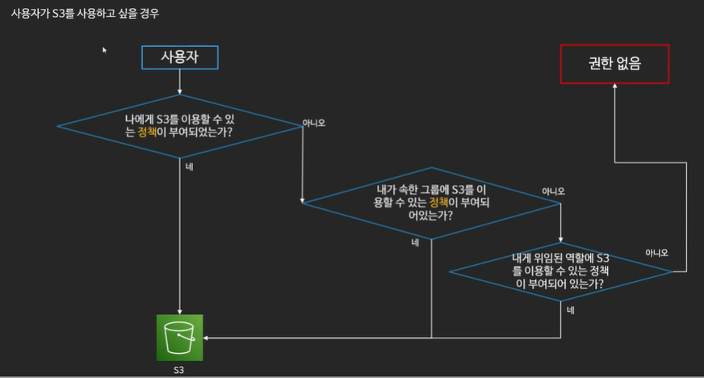

# IAM

### IAM 소개

* AWS 어카운트 관리 및 리소스/사용자/서비스의 권한 제어
  * 서비스 사용을 위한 인증 정보 부여
* 사용자의 생성 / 관리 및 계정의 보안
  * 사용자의 패스워드 정책관리(일정 시간마다 패스워드 변경 등)
* 다른 계정과의 리소스 공유
  * Identity Federation (Facebook 로그인, 구글 로그인 등)
* 계정에 별명 부여 가능 -> 로그인 주소 생성 가능
* IAM은 글로벌 서비스

### IAM 구성

* 사용자
  * 실제 AWS를 사용하는 사람, 어플리케이션 의미
* 그룹
  * 사용자의 집합
  * 그룹에 속한 사용자는 그룹에 부여된 권한을 행사
* 정책(Policy)
  * 사용자와 그룹, 역할이 무엇을 할 수 있는지에 관한 문서
  * JSON형식으로 정의
* 역할(Role)
  * AWS 리소스에 부여하여 AWS 리소스가 무엇을 할 수 있는지를 정의
  * 혹은 다른 사용자가 역할을 부여 받아 사용
  * 다른 자격에 대해서 신뢰관계를 구축 가능
  * 역할을 바꾸어 가며 서비스 사용 가능

### IAM의 권한 검증

### IAM 모범 사용 사례

* 루트 사용자는 사용하지 않기
* 불필요한 사용자 만들지 않기
* 가능하면 그룹과 정책을 사용하기
* 최소한의 권한만을 허용하는 습관 들이기
* MFA를 활성화 하기
* AccessKey 대신 역할을 활용하기
* IAM 자격 증명 보고서 활용하기