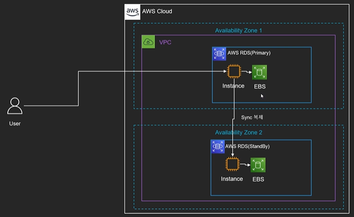

# RDS

관계형 데이터베이스를 간편하게 설정, 운영 및 확장할 수 있는 서비스.

## RDS 아키텍쳐

## RDS 특징

* 관계형 데이터베이스를 제공하는 서비스
  * Relational Database Service : 관계형 데이터베이스
  * <-> NoSql(DynamoDB, DocumentDB, ElasticCache)
* 가상 머신 위에서 동작
  * 단 직접 시스템에 직접 로그인 불가능 -> OS패치, 관리등은 AWS의 역할
* RDS는 Serverless 서비스가 아님
  * 단 Aurora Serverless는 말 그대로 Serverless 서비스
* CloudWatch와 연동
  * DB 인스턴스의 모니터링(EC2와 동일)
  * DB에서 발생하는 여러 로그를 CloudWatch와 연동하여 확인 가능
* 내부에서는 EC2를 활용
  * VPC안에서 동작
    * 기본적으로 public IP를 부여하지 않아 외부에서 접근 불가능
    * 설정에 따라 Public으로 오픈 가능(DNS로 접근)
  * 서브넷과 보안그룹 지정 필요
  * EC2 타입의 지정 필요
  * 스토리지는 EBS 활용
    * EBS 타입 선택 필요
    * 생성시 EBS 용량을 지정해서 생성
* Parameter Group : Root 유저만 설정 가능한 DB 설정값들을 모아 그룹화한 개념
  * DB클러스터에 파라미터 그룹을 적용시켜 설정값을 적용
* 업데이트
  * 마이너 버전 엔진 업데이트는 자동으로 업데이트 설정 가능
  * 기타 업데이트의 경우 점검 시간을 설정하여 특정 시간에 업데이트가 이루어질 수 있도록 설정 가능

## RDS 인증 방법

* 전통적인 유저/패스워드 방식
  * AWS Secret Manager와 연동하여 자동 로테이션 가능
* IAM DB 인증
  * 데이터베이스를 IAM 유저 크레덴셜/Role을 통해 관리 가능
* Kerberos 인증

## RDS 가격 모델

* 컴퓨팅 파워 + 스토리지 용량 + 백업 용량 + 네트워크 비용
* Reserved Instance 구매 가능
  * EC2와 마찬가지로 일정 기간을 계약하여 저렴한 가격에 서비스 이용

## RDS 암호화

* 암호화 지원
  * SQL 서버 혹은 Oracle에서는 TDE(Transparent Data Encryption) 지원
  * 모든 엔진에서 EBS 볼륨 암호화 지원
    * Default Master Key 혹은 생성한 Master Key 선택 가능
  * 자동 백업, 스냅샷, Read Replica 등에 적용

## RDS 백업

* 자동 백업
  * 매일마다 스냅샷을 만들고 트랜잭션 로그 저장
  * 데이터는 S3에 저장되며 데이터베이스의 크기 만큼의 공간 점유
  * 저장된 데이터를 바탕으로 일정 기간 내의 특정 시간으로 롤백 가능
    * 다른 DB 클러스터를 새로 생성
  * 1~35일까지 보관 지원
  * Backup을 시행할 때는 약간의 딜레이 발생 가능성
  * 기본적으로 사용 상태로 설정되어 있음
* 수동 백업(DB 스냅샷)
  * 유저, 혹은 다른 프로세스로부터 요청에 따라 만들어지는 스냅샷
  * 데이터베이스가 삭제된 이후에도 계속 보관
  * 스냅샷의 복구는 항상 새로운 DB Instance를 생성하여 수행

