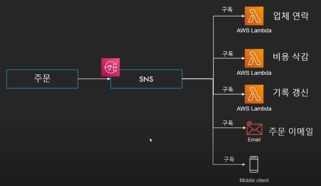

# SES, SNS, SQS

## SES(Simple Email Service)

* 이메일을 보내거나 받을 수 있는 서비스
* 이메일을 받을 때 여러 방법으로 처리 가능
  * Lambda 호출
  * SNS 호출
  * S3에 이메일 저장
* 대량의 이메일을 보내기 위해서는 샌드박스 모드 해제 필요(AWS Support 센터)
  * 무분별한 스팸 메일 발송 예방 차원

 

## SNS(Simple Notification Service)

* Pub/Sub 기반의 메세징 서비스(구독/발행)
  * 하나의 토픽을 여러 주체가 구독
    * 토픽에 전달된 내용을 구독한 모든 주체가 전달받아 처리
* 다양한 프로토콜로 메시지 전달 가능
  * 이메일
  * HTTP(S)
  * SQS
  * SMS
  * Lambda
* **하나의 메시지를 여러 서비스에서 처리**

 

## SQS(Simple Queue Service)

* AWS에서 제공하는 큐 서비스
  * 다른 서비스에서 사용할 수 있도록 메시지를 잠시 저장하는 용도
  * 최대 사이즈 : 256kb, 최대 14일까지 저장 가능
* 주로 AWS 서비스들의 느슨한 연결을 수립하려 사용
* **하나의 메시지를 한번만 처리**
* AWS에서 제일 오래된 서비스

* SQS의 필요성
  * 메시지 전달 안정성
  * 확장성, 가용성

 

## SNS vs SQS

| 내용             | SNS                                       | SQS                                          |
| ---------------- | ----------------------------------------- | -------------------------------------------- |
| 목적             | 여러 서비스에 메시지를 전달하기 위해 사용 | 특정 작업을 다음 서비스로 넘겨주기 위해 사용 |
| 메시지 처리 횟수 | 하나의 세미지를 여러 서비스에서 처리      | 하나의 메시지는 한번만 처리                  |
| 메시지 보관      | 보관 불가                                 | 최대 14일 보관 가능                          |
| 전달 방식        | PUSH                                      | PULL                                         |
| 아키텍쳐 활용    | Fan Out                                   | 디커플링                                     |

