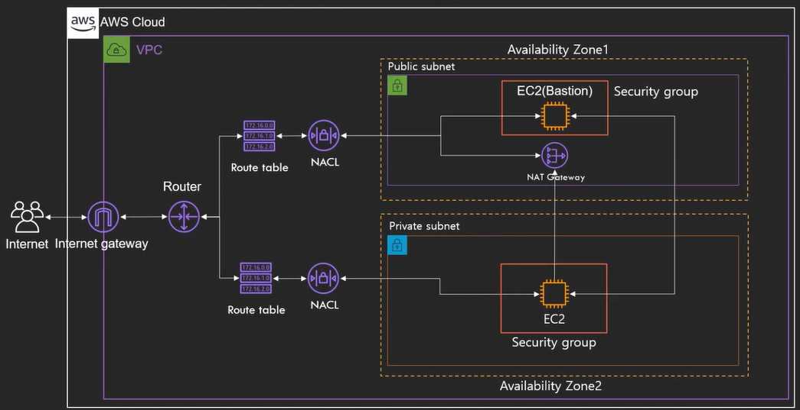

# VPC

Virtual Private Cloud

사용자가 정의한 논리적으로 격리된 가상 네트워크에서 AWS 리소스를 시작할 수 있도록 하는 서비스

## VPC란?

* Default VPC
  * 계정 생성시 자동으로 셋업 (모든 리전)
  * 모든 서브넷의 인터넷 접근 가능
  * EC2가 Public IP와 Private IP 모두 가지고 있음
  * 삭제시 복구 불가
* Custom VPC
  * 새로 생성해야 함
  * Default VPC의 특징을 가지고 있지 않음

* VPC를 사용하여 할 수 있는 일들
  * EC2 실행 가능
  * 서브넷을 구성 가능
  * 보안설정(IP Block, 인터넷에 노출되지 않은 EC2 구성 등) 가능
* VPC Peering : VPC간에 연결
  * Transitive Peering 불가능 : 한 다리 건너 연결 되어 있으면 Peering 안됨
* VPC Flow Log
  * VPC의 로그를 CloudWatch에 저장 가능
* IP 대역 지정 가능
* Region에 하나 : 다른 Region으로 확장 불가능

 

## VPC의 구성요소

### AZ(Availability Zone)

* 물리적으로 분리되어 있는 인프라가 모여 있는 데이터 센터
* 고가용성을 위해 항상 일정 거리 이상 떨어져 있음
* 하나의 리전은 2개 이상의 AZ로 구성
* 각 계정의 AZ는 다른 계정의 AZ와 다른 아이디를 부여 받음
  * 계정 1의 AZ-A는 계정 2의 AZ-A와 다른 곳에 있음

### Subnet

* VPC의 하위 단위
* 하나의 AZ에만 생성 가능 : 다른 AZ로 확장 불가
  * 하나의 AZ에는 여러 Subnet 생성 가능
* Private Subnet : 인터넷에 접근 불가능한 Subnet
* Public Subnet : 인터넷에 접근 가능한 Subnet
* CIDR Block Range 설정 가능 (IP주소를 분배하는 방법)

### IGW(Internet Gateway)

* 인터넷으로 나가는 통로
* 고가용성이 확보되어 있음
* IGW로 연결되어 있지 않은 서브넷 = Private Subnet
* Route Table에서 연결해줘야 함

### NACL / Security Group

* 검문소
* NACL = Stateless, SG = Stateful
* 기본적으로 VPC 생성시 만들어줌
* Deny는 NACL에서만 가능

### Route Table

* 트래픽이 어디로 가야 할지 알려주는 이정표
* 기본적으로 VPC 생성시 만들어줌