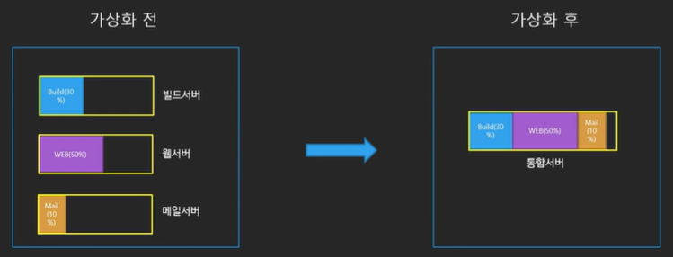
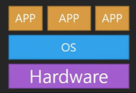
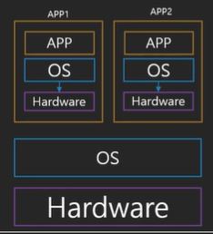
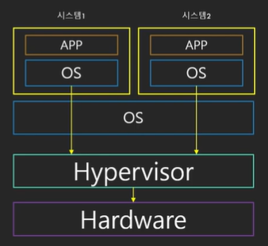
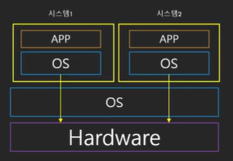

# 가상화(virtualization)

### 가상화란

단일 컴퓨터의 하드웨어 요소를 일반적으로 가상 머신(VM)이라고 하는 다수의 가상 컴퓨터로 분할할 수 있도록 해주는 기술

 

 

### 가상화의 역사

##### 가상화 등장 전

##### 1세대 : 완전 가상화(Fully Emulated)

* 모든 시스템 요소가 에뮬레이터 안에서 돌아감
* 즉 CPU, 하드디스크, 마더보드 등 모든 요소를 에뮬레이터로 구현하여 OS와 연동
* 엄청나게 느림

##### 2세대 : Paravirtualization

* Guest OS는 하이퍼바이저와 통신
* 하이퍼바이저 : OS와 하드웨어 사이에 존재하는 일종의 가상화 매니저
* 속도의 향상
* 몇몇 요소의 경우 여전히 에뮬레이터 필요 : 느림

##### 3세대 : Hardware Virtual Machine(HVM)

* 하드웨어에서 직접 가상화를 지원
* 직접 Guest OS가 하드웨어와 통신 : 빠른 속도(near bare-metal)

 

### 가상화와 클라우드

* AWS 클라우드 환경에서 리소스를 작은 단위로 빠르게 구성할 수 있는 원동력은 가상화
* 사용자마다 컴퓨터를 할당해 주는 것이 아닌 이미 구축된 가상화 가능한 서버의 한 부분을 할당 해주는 것

