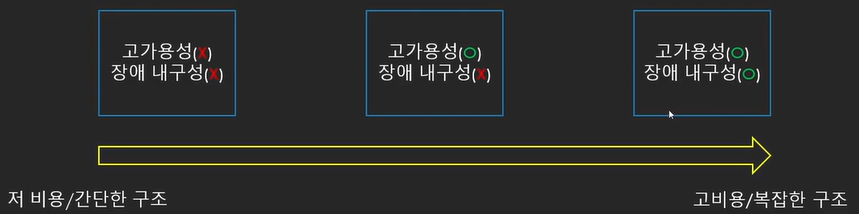

# 클라우드 관련 개념, 용어

### 고가용성(High Availability, HA)

* 장애 상황을 해결하고 서비스를 지속할 수 있는 능력
  * 장애 상황을 위한 준비가 필요

### 장애 내구성 / 내결함성(Fault Tolerance)

* **장애 상황에도** 서비스를 지속할 수 있는 능력
  * 장애 상황에 영향을 받지 않는 아키텍쳐 필요

### 재해 복구(Disaster Recovery)

* 장애 상황을 복구하는 것
  * 서버 클러스터가 터졌다면 서버를 교체하는 과정
  * 백업 서버를 운영하거나 준비하는 것.

### 확장성(Scalability)

* 쉽고 빠르게 규모를 늘릴 수 있는 능력
  * 주로 수요에 따라 컴퓨팅 파워 혹은 용량 확장

### 탄력성(Elasticity)

* 수요에 따라 컴퓨팅 파워/용량을 확장하거나 축소할 수 있는 능력
  * 불필요한 자원을 사용하지 않고 비용 최적화에 필수적인 능력

