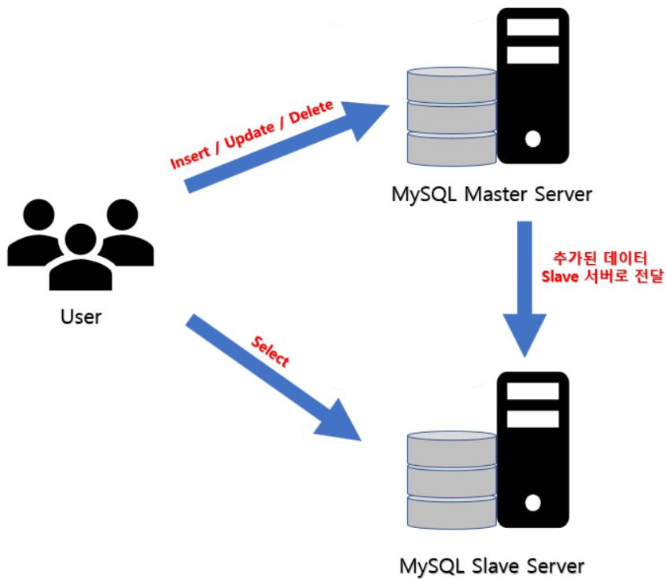
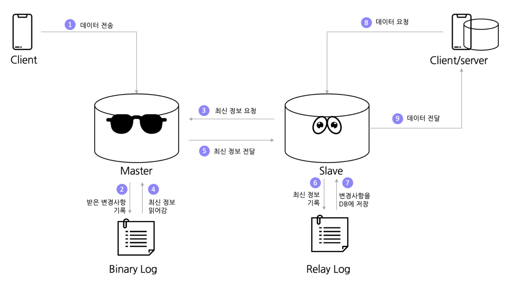

# DB(Master&Slave구조)

DB에 대한 트래픽 분산을 위해서 Mysql Replication 등 을 통해서 트래픽 집중 문제를 해결

Master에게는 데이터 동시성이 높게 요구되는 트랜잭션을 담당하게 하고, Slave에게는 읽기 전용으로 데이터를 가져옴.

1. 클라이언트가 마스터 DB 서버에 데이터를 전송
2. Master 서버는 들어오는 데이터를 Binary Log라는 메모장에 적어두었다가 때가되면 DB에 업데이트.
3. 이 와중에 Slave 서버가 최신 데이터를 요청.
4. Master 서버는 Binary Log에 적어둔 최신 정보를 읽어서 Slave서버에 전달.
5. Slave 서버는 이 정보들을 자신의 메모장인 Relay Log에 적었다가 나중에 한번에 변경사항을 DB에 등록.
6. 다른 클라이언트나 서버가 데이터를 요청하면 Slave 서버가 동기화된 데이터를 전달.