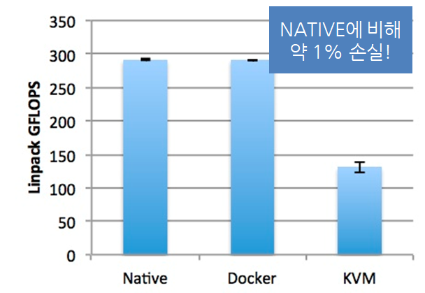
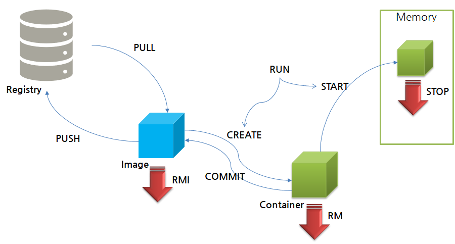

# Docker

- 컨테이너 기술의 사실상 표준
- 다양한 운영체제에서 사용 가능
- 어플리케이션에 국한되지 않고 의존성 및 파일 시스템까지 패키징하여 빌드, 배포, 실행을 단순화
- 리눅스의 네임 스페이스와 cgroups와 같은 커널 기능을 사용하여 가상화


* 다양한 클라우드 서비스 모델과 같이 사용 가능

  * 이미지 : 필요한 프로그램과 라이브러리, 소스를 설치한 뒤 만든 하나의 파일
  * 컨테이너 : 이미지를 격리하여 독립된 공간에서 실행한 가상 환경

  

### 컨테이너

* 동일한 시스템에서 실행하는 소프트웨어는 컴포넌트가 충돌하거나 다양한 종속성을 가짐.
* 컨테이너는 가상머신을 사용해 각 마이크로 서비스를 격리하는 기술
* 컨테이너는 가상머신처럼 하드웨어를 전부 구현하지 않기 때문에 매우 빠른 실행 가능




### Docker의 한계

서비스가 커질수록 관리해야하는 컨테이너의 양이 급격히 증가하여 배포 및 관리가 어려움.

-> 쿠버네티스 사용


### Docker 라이프 사이클



* 도커 이미지 다운로드와 삭제

```bash
docker pull consol/tomcat-7.0
docker rmi consol/tomcat-7.0
```

* 도커 이미지들 보기

```bash
docker images 
```

* 컨테이너 생성

```bash
docker create {옵션} {이미지명}:{태그}
# 예: docker create -it python
```

* 컨테이너 실행

```bash
docker start {이미지명}:{태그}
```

* 컨테이너 정지

```bash
docker stop {이미지명}:{태그}
```

* 이미지 다운부터 컨테이너 생성 및 실행 
```bash
docker run -d --name tc tomcat # 톰캣 생성 및 실행
```


| 옵션                                           | 설명                                                         |
| ---------------------------------------------- | ------------------------------------------------------------ |
| -d                                             | 데몬으로 실행(*뒤*에서 - 안 보이는 곳(백그라운드)에서 알아서 돌라고 하기) |
| -it                                            | 컨테이너로 들어갔을 때 bash로 CLI 입출력을 사용할 수 있도록 해 줍니다. |
| --name {이름}                                  | 컨테이너 이름 지정                                           |
| -p {호스트의 포트 번호}:{컨테이너의 포트 번호} | 호스트와 컨테이너의 포트를 연결합니다.                       |
| --rm                                           | 컨테이너가 종료되면{내부에서 돌아가는 작업이 끝나면} 컨테이너를 제거합니다. |
| -v {호스트의 디렉토리}:{컨테이너의 디렉토리}   | 호스트와 컨테이너의 디렉토리를 연결합니다.                   |
| -e {변수명}={변수값}   | 컨테이너에서 사용할 환경변수 설정 |

* 실행중인 컨테이너 확인

```bash
docker ps # 톰캣 컨테이너 확인
CONTAINER ID   IMAGE    COMMAND             CREATED          STATUS          PORTS      NAMES
f6e513b399a6   tomcat   "catalina.sh run"   27 seconds ago   Up 26 seconds   8080/tcp   tc
```

* 모든 컨테이너 확인

```bash
docker ps -a # 모든 컨테이너 확인
```

* 컨테이너 중지

```bash
docker stop f6e513b399a6 # 컨테이너 실행 중지
f6e513b399a6
```

* 컨테이너 삭제

```bash
docker rm f6e513b399a6 # 컨테이너 삭제
f6e513b399a6
```

* 로그 확인

```bash
docker container logs -t {컨테이너식별자}
```

