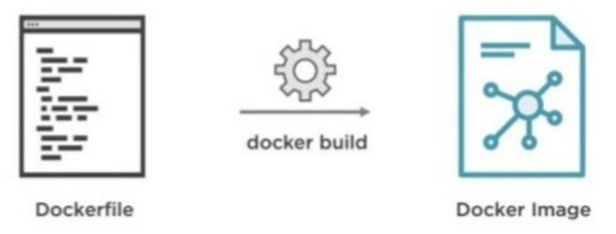

# Docker

- 컨테이너 기술의 사실상 표준
- 다양한 운영체제에서 사용 가능
- 어플리케이션에 국한되지 않고 의존성 및 파일 시스템까지 패키징하여 빌드, 배포, 실행을 단순화
- 리눅스의 네임 스페이스와 cgroups와 같은 커널 기능을 사용하여 가상화


* 다양한 클라우드 서비스 모델과 같이 사용 가능
  
  * 이미지 : 필요한 프로그램과 라이브러리, 소스를 설치한 뒤 만든 하나의 파일
  * 컨테이너 : 이미지를 격리하여 독립된 공간에서 실행한 가상 환경

### 컨테이너

* 동일한 시스템에서 실행하는 소프트웨어는 컴포넌트가 충돌하거나 다양한 종속성을 가짐.
* 컨테이너는 가상머신을 사용해 각 마이크로 서비스를 격리하는 기술
* 컨테이너는 가상머신처럼 하드웨어를 전부 구현하지 않기 때문에 매우 빠른 실행 가능


### Docker의 한계

서비스가 커질수록 관리해야하는 컨테이너의 양이 급격히 증가하여 배포 및 관리가 어려움.

-> 쿠버네티스 사용

### Docker 라이프 사이클


* 도커 이미지 다운로드와 삭제

```bash
docker pull consol/tomcat-7.0
docker rmi consol/tomcat-7.0
```

* 도커 이미지들 보기

```bash
docker images 
```

* 컨테이너 생성

```bash
docker create {옵션} {이미지명}:{태그}
# 예: docker create -it python
```

* 컨테이너 실행

```bash
docker start {이미지명}:{태그}
```

* 컨테이너 정지

```bash
docker stop {이미지명}:{태그}
```

* 이미지 다운부터 컨테이너 생성 및 실행 
  
  ```bash
  docker run -d --name tc tomcat # 톰캣 생성 및 실행
  ```

| 옵션                            | 설명                                           |
| ----------------------------- | -------------------------------------------- |
| -d                            | 데몬으로 실행(*뒤*에서 - 안 보이는 곳(백그라운드)에서 알아서 돌라고 하기) |
| -it                           | 컨테이너로 들어갔을 때 bash로 CLI 입출력을 사용할 수 있도록 해 줍니다. |
| --name {이름}                   | 컨테이너 이름 지정                                   |
| -p {호스트의 포트 번호}:{컨테이너의 포트 번호} | 호스트와 컨테이너의 포트를 연결합니다.                        |
| --rm                          | 컨테이너가 종료되면{내부에서 돌아가는 작업이 끝나면} 컨테이너를 제거합니다.   |
| -v {호스트의 디렉토리}:{컨테이너의 디렉토리}   | 호스트와 컨테이너의 디렉토리를 연결합니다.                      |
| -e {변수명}={변수값}                | 컨테이너에서 사용할 환경변수 설정                           |

* 실행중인 컨테이너 확인

```bash
docker ps # 톰캣 컨테이너 확인
CONTAINER ID   IMAGE    COMMAND             CREATED          STATUS          PORTS      NAMES
f6e513b399a6   tomcat   "catalina.sh run"   27 seconds ago   Up 26 seconds   8080/tcp   tc
```

* 모든 컨테이너 확인

```bash
docker ps -a # 모든 컨테이너 확인
```

* 컨테이너 중지

```bash
docker stop f6e513b399a6 # 컨테이너 실행 중지
f6e513b399a6
```

* 컨테이너 삭제

```bash
docker rm f6e513b399a6 # 컨테이너 삭제
f6e513b399a6
```

* 로그 확인

```bash
docker container logs -t {컨테이너식별자}
```

---

### 로컬에 저장 되어 있는 이미지 옮기기

* windows 기준 이미지 저장 경로
  
  * `%USERPROFILE%\AppData\Local\Docker\wsl\data\ext4.vhdx`

해당 파일을 복사해서 옮기면 전체 이미지를 옮길 수 있지만 특정 이미지만을 복사해서 옮기기 위해선 아래와 같은 방법을 사용한다.

##### 1. 다운 받은 이미지 확인

```bash
docker images
```

##### 2. 내부에 있는 이미지 이동시키기

```shell
docker save -o [이동할 경로] [이동시킬 이미지]
```

```shell
C:\User\bumsoo> docker save -o C:\WS\kafka-ui.tar provectuslabs/kafka-ui
```

이때 커맨드를 사용되는 프로그램은 **관리자 권한으로 실행**되어야 한다.

##### 3. tar 파일 이미지 로드

```shell
docker load -i kafka-ui.tar
```

---

# Dockerfile



Dockerfile은 Docker 이미지(image)가 어떤 단계를 거쳐 빌드(build)되야 하는지를 담고있는 텍스트 파일입니다. Docker는 Dockerfile에 나열된 명령문을 차례대로 수행하여 이미지를 생성해줍니다.

| 명령어        | 용도                               |
| ---------- | -------------------------------- |
| FROM       | base 이미지 설정                      |
| WORKDIR    | 작업 디렉토리 설정                       |
| RUN        | 이미지 빌드시 커맨드 실행                   |
| ENTRYPOINT | 이미지 실행시 항상 실행되어야 하는 커맨드 설정       |
| CMD        | 이미지 실행시 디폴트 커맨드 또는 파라미터 설정       |
| EXPOSE     | 컨테이너가 리스닝할 포트 및 프로토콜 설정          |
| COPY / ADD | 이미지의 파일 시스템으로 파일 또는 디렉토리 복사      |
| ENV        | 환경 변수 설정                         |
| ARG        | 빌드시 넘어올 수 있는 인자 설정               |
| VOLUME     | 호스트와 공유할 컨테이너 내부의 디렉토리 설정        |
| USER       | 컨테이너 내에서 사용될 사용자 계정의 이름이나 UID 설정 |

### FROM

`FROM` 명령문은 base 이미지를 지정해주기 위해서 사용되는데 보통 Dockerfile 최상단에 위치.

```dockerfile
FROM ubuntu:latest  # 우분투 최신 버전을 base 이미지로 사용
FROM node:12  # NodeJS12를 base 이미지로 사용
FROM python:3.8-alpine  # 파이썬3.8(alpine 리눅스 기반)을 base 이미지로 사용
```

### WORKDIR

`shell`의 `cd` 명령문처럼 컨테이너 상에서 작업 디렉토리로 전환을 위해 사용.

`WORKDIR` 명령문으로 작업 디렉토리를  전환하면 이후 실행되는 모든 명령문은 해당 디렉토리를 기준으로 실행.

```dockerfile
WORKDIR /usr/app  # usr/app으로 작업 디렉토리 전환
```

### RUN

```dockerfile
RUN ["<커맨드>", "<파라미터1>", "<파라미터2>"]
RUN <전체 커맨드>
```

`shell`에서 커맨드를 실행하는 것처럼 이미지 빌드 과정에서 필요한 커맨드를 실행하기 위해 사용.

보통 이미지 안에 특정 소프트웨어를 설치하기 위해 많이 사용 됨.

```dockerfile
RUN apk add curl  # curl 도구 설치
RUN npm install --silent  # npm 패키지 설치
RUN pip install -r requirements.txt  # pip 패키지 설치
```

### ENTRYPOINT

```dockerfile
ENTRYPOINT ["<커맨드>", "<파라미터1>", "<파라미터2>"]
ENTRYPOINT <전체 커맨드>
```

이미지를 컨테이너로 띄울 때 항상 실행되어야 하는 커맨드를 지정.

Docker 이미지를 하나의 실행 파일처럼 사용할 때 유용 : 컨테이너가 뜰 때 `ENTRYPOINT` 명령문으로 지정된 커맨드가 실행되고, 이 커맨드로 실행된 프로세스가 죽을 때 컨테이너가 따라서 종료됨.

```dockerfile
ENTRYPOINT ["npm", "start"]  # npm start 스크립트 실행
ENTRYPOINT ["python", "manage.py", "runserver"]  # Django 서버 실행
```

### CMD

```dockerfile
CMD ["<커맨드>","<파라미터1>","<파라미터2>"]
CMD ["<파라미터1>","<파라미터2>"]
CMD <전체 커맨드>
```

해당 이미지를 컨테이너로 띄울 때 디폴트로 실행할 커맨드나 `ENTRYPOINT` 로 지정된 커맨드에 디폴트로 넘길 파라미터를 지정할 때 사용

`RUN` 명령문은 이미지 빌드 시 항상 실행되고 Dockerfile에 여러 개를 선언 할 수 있지만,

`CMD` 명령문은 이미지를 컨테이너로 띄울 때 딱 한 번만 실행됨.

### COPY / ADD

```dockerfile
COPY <src>... <dest>
COPY ["<src>",... "<dest>"]
```

호스트 컴퓨터에 있는 디렉토리나 파일을 Docker 이미지의 파일 시스템으로 복사하기 위해 사용

절대 경로, 상대 경로 모두 지원

```dockerfile
# package.json 파일만 복사
COPY package.json package.json
```

```dockerfile
# 이미지를 빌드한 디렉토리의 모든 파일을 컨테이너 app/ 디렉토리로 복사
WORKDIR app/
COPY . .
```

`ADD` 명령문은 좀더 파워풀한 `COPY` 명령문.

`ADD` 명령문은 일반 파일 뿐만 아니라 압축 파일이나 네트워크 상의 파일도 사용 가능.

특수한 파일을 다루는게 아니라면 `COPY`명령문 사용을 권장.

### ENV

```dockerfile
ENV <키> <값>
ENV <키>=<값>
```

환경 변수를 설정하기 위해 사용

`ENV` 명령문으로 설정된 환경 변수는 이미지 빌드 시에도 사용되고, 해당 컨테이너에서 돌아가는 애플리케이션에서도 사용 가능.
