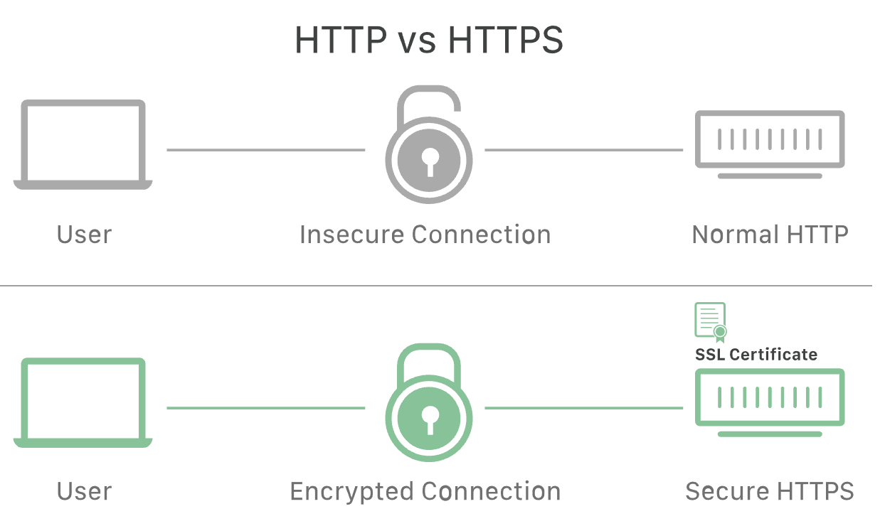

# SSL, TLS, HTTPS

## SSL(Secure Sockets Layer)

원래 웹에서의 데이터는 가로채면 누구나 읽을 수 있는 일반 텍스트 형태로 전송 되었다. 이러한 문제 때문에 인터넷 통신의 개인정보 보호, 인증, 데이터 무결성을 보장하기 위해 Netscape가 1995년 처음으로 SSL을 개발 했다.

SSL은 **암호화 기반 인터넷 보안 프로토콜**이다. 전달되는 모든 데이터를 암호화하고 특정한 유형의 사이버 공격도 차단한다. **SSL은 TLS 암호화의 전신**이기도 하다.

**SSL/TLS를 사용하는 웹사이트 URL은 HTTP 대신 HTTPS가 사용**된다.

SSL은 1996년 SSL 3.0 이후 업데이트 되지 않았으며, 앞으로 사라지게 될 것으로 여겨지고 있다. 또한 알려진 취약성이 여러가지 있으며 보안 전문가들은 SSL 사용 중단을 권장하고 있다. 그 대안으로 TLS가 있다.

TLS는 최신 암호화 프로토콜로, SSL암호화로 혼용해서 부르는 경우도 많다. 실제로 현재 SSL을 인증한 업체 및 제공하는 업체는 사실상 TLS암호화를 제공하고 있는 것이다.

## TLS(Transport Layer Security)

TLS는 SSL의 업데이트 버전으로 SSL의 최종버전인 3.0과 TLS의 최초버전의 차이는 크지 않으며, 이름이 바뀐것은 SSL을 개발한 Netscape가 업데이트에 참여하지 않게 되어 소유권 변경을 위해서 였다고 한다.

결과적으로 TLS는 SSL의 업데이트 버전이며 명칭만 다르다고 볼 수 있다.

## SSL/TLS 작동 방식

SSL은 개인정보 보호를 제공하기 위해, 웹에서 전송되는 **데이터를 암호화** 한다. 따라서, 데이터를 가로채려해도 거의 **복호화가 불가능**하다.

SSL은 클라이언트와 서버간의 **핸드쉐이크를 통해 인증**이 이루어진다. 또한 **데이터 무결성**을 위해 데이터에 디지털 서명을 하여 데이터가 의도적으로 도착하기 전에 조작된 여부를 확인한다.

## SSL/TLS 핸드쉐이크

핸드쉐이크는 클라이언트와 서버간의 메시지 교환이며, HTTPS 웹에 처음 커넥션할 때 진행된다.

핸드쉐이크의 단계는 클라이언트와 서버에서 지원하는 암호화 알고리즘, 키 교환 알고리즘에 따라 달라진다.

일반적으로 **RSA키 교환 알고리즘**이 사용된다.

#### RSA 키교환 알고리즘 순서

1. 클라이언트 -> 서버 메시지 전송 : 핸드쉐이크 시작. 이 메시지에는 TLS버전, 암호화 알고리즘, 무작위 바이트 문자열이 포함.
2. 서버 -> 클라이언트 메시지 전송 : 클라이언트 메시지의 응답으로 서버의 SSL인증서, 선택한 암호화 알고리즘, 서버에서 생성한 무작위 바이트 문자열을 포함한 메시지를 전송. 
3. 인증 : 클라이언트가 서버의 SSL인증서를 인증 발행 기관에 검증.
4. 예비 마스터 암호 : 클라이언트는 무작위 바이트 문자열을 공개 키로 암호화된  pre-master secret key를 서버로 전송.
5. 개인 키 사용 : 서버가 pre-master secret key를 개인 key를 통해 복호화.
6. 세션 키 생성 : 클라이언트와 서버는 클라이언트가 생성한 무작위 key, 서버가 생성한 무작위 key, pre-master secret key를 통해 세션 key를 생성.
7. 클라이언트 완료 전송 : 클라이언트는 세션 키로 암호화된 완료 메시지를 전송.
8. 서버 완료 전송 : 서버도 세션 키로 암호화된 완료 메시지를 전송.
9. 핸드쉐이크 완료 : 핸드쉐이크가 완료되고 세션 키를 이용해 통신을 진행.

## SSL/TLS 인증서

SSL은 SSL인증서(=TLS인증서)가 있는 웹사이트만 실행 할 수 있다. 인증서는 사람의 신분증과 유사하다고 볼 수 있다.

SSL인증서는 공개 키가 포함된다. 이 공개키 덕분에 암호화가 가능하게 된다.

클라이언트의 요청은 공개 키를 이용해 서버에 암호화하여 전달한다.

서버에도 공개되지 않는 개인 키가 있는데 이 개인 키를 이용해 암호화된 데이터를 복호화 한다.

해당 인증서를 발급하는 기관은 CA(Certificate Authority)라고 한다.

#### 인증서의 종류 및 유형

인증서는 적용되는 도메인의 개수 및 유효성 검사 수준에 따라 유형이 나뉜다.

##### 적용되는 도메인 개수에 따른 유형

* 단일 도메인(Single domain) : 단 하나의 도메인에만 적용이 가능한 인증서
* 와일드카드(Wildcard) : 단일 도메인 인증서처럼 하나의 도메인에만 적용되지만, 해당 도메인의 하위 도메인도 포함된다. 예를 들어 www.example.com, blog.example.com, delvelopoers.example.com 등을 포함 할 수 있다.
* 멀티 도메인(Multi domain) : 관련되지 않은 여러 도메인에 적용 할 수 있는 인증서

##### 유효성 검사 수준에 따른 유형

* 도메인 유효성 검사(Domain Validation) : 가장 느슨한 수준의 유효성 검사, 기입이 도메인을 관리하고 있다는 것 정도만 증명.
* 조직 유효성 검사(Organization Validation) : 인증서 발급 시 CA가 기업을 확인하여 증명(사업자 등록증, 신청자 등)
* 확장 유효성 검사(Extended Validation) : CA는 조직이 존재하고 법적으로 사업자로 등록되어 있는지, 유효한 주소인지 등을 확인. 그만큼 시간이 오래 걸리고 비용이 많이 들지만 가장 큰 신뢰를 제공.