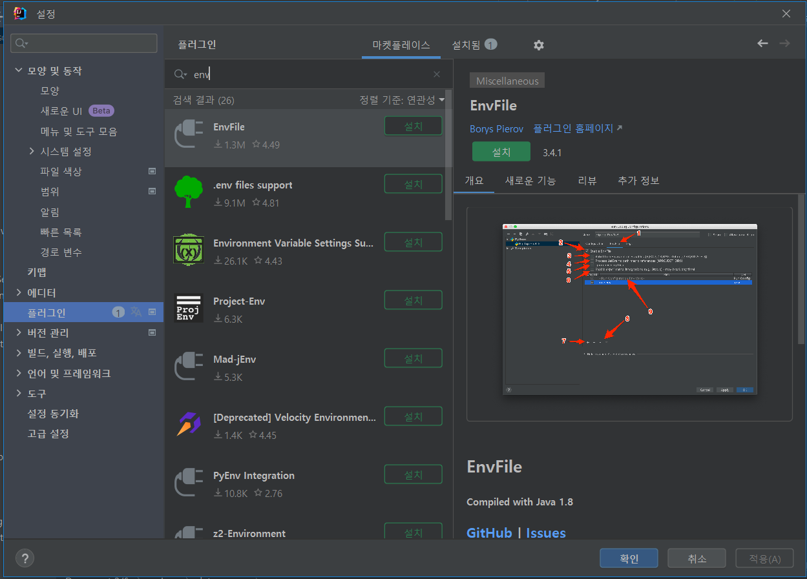
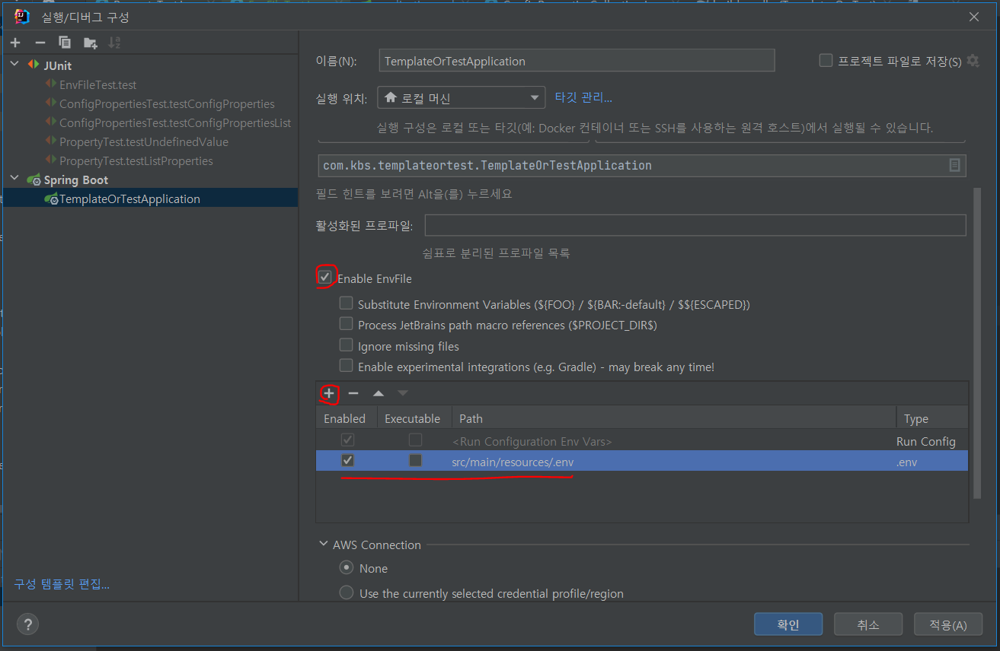

# [IntelliJ]EnvFile Pluging (로컬 파일 환경변수관리)

MSA환경에서 여러 개의 어플리케이션이 동일한 환경변수를 사용할 경우,
로컬에서 인텔리제이로 실행 및 테스트시에 매번 같은 환경변수 설정을 해줘야하는 불편함이 있습니다.
거기다 하나의 서비스에서 사용되는 환경변수의 수가 많다면 더욱 그렇죠.
또한 설정파일(application.yml)에서 환경변수 없이 local Profile을 분리해서 사용한다면
중요한 정보(암호화 key, password 등)를 버전관리저장소에 업로드하여 보안에 취약한 상황이 발생합니다.

이런 상황에 유용한 `EnvFile` 플러그인이 있습니다.

`EnvFile` 플러그인은 파일에 환경변수를 작성해서 여러 어플리케이션에서 사용 할 수 있게 해줍니다.
환경변수 파일을 버전관리저장소에 올리지 않고 따로 관리한다면 좀 더 안전하게 관리가 될 수 있습니다.


### 설치 및 사용법



인텔리제이 메뉴 `[설정]` - `[플러그인]` 에서 EnvFile 을 검색 후 설치 및 재시작 합니다.

환경변수를 작성할 .env 파일을 만듭니다.
파일 내용은 `변수명="변수값"` 형태로 구성 됩니다.
```
ENV1="kbs"
ENV2="ljs"
ENV3="ksy"
ENV4="kpy"
```


`실행/디버그 구성` 창에서 `Enable EnvFil`을 체크하고 `+` 버튼으로 생성한 `.nev` 파일을 추가 합니다.
이렇게 실행/디버그/테스트를 하면 파일에 등록된 환경변수가 사용됩니다. 