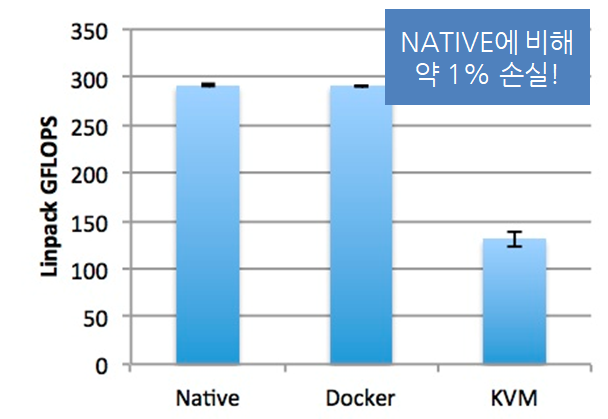

# Docker란

- 컨테이너 기술의 사실상 표준
- 다양한 운영체제에서 사용 가능
- 어플리케이션에 국한되지 않고 의존성 및 파일 시스템까지 패키징하여 빌드, 배포, 실행을 단순화
- 리눅스의 네임 스페이스와 cgroups와 같은 커널 기능을 사용하여 가상화

* 다양한 클라우드 서비스 모델과 같이 사용 가능

  * 이미지 : 필요한 프로그램과 라이브러리, 소스를 설치한 뒤 만든 하나의 파일
  * 컨테이너 : 이미지를 격리하여 독립된 공간에서 실행한 가상 환경

  

### 컨테이너

* 동일한 시스템에서 실행하는 소프트웨어는 컴포넌트가 충돌하거나 다양한 종속성을 가짐.
* 컨테이너는 가상머신을 사용해 각 마이크로 서비스를 격리하는 기술
* 컨테이너는 가상머신처럼 하드웨어를 전부 구현하지 않기 때문에 매우 빠른 실행 가능

### Docker의 한계

서비스가 커질수록 관리해야하는 컨테이너의 양이 급격히 증가하여 배포 및 관리가 어려움.

-> 쿠버네티스 사용
