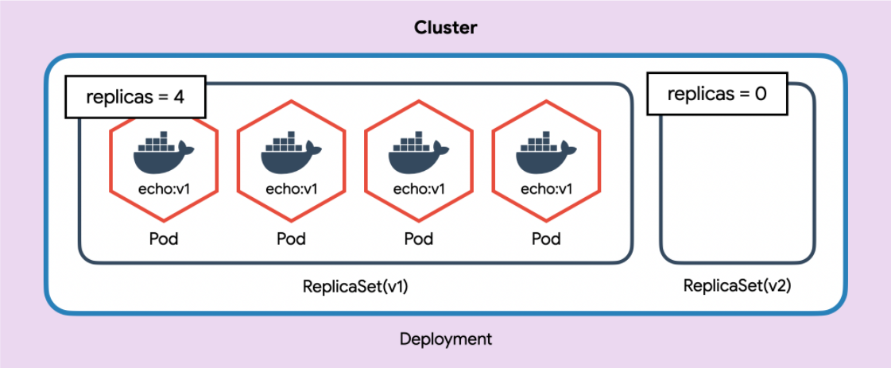
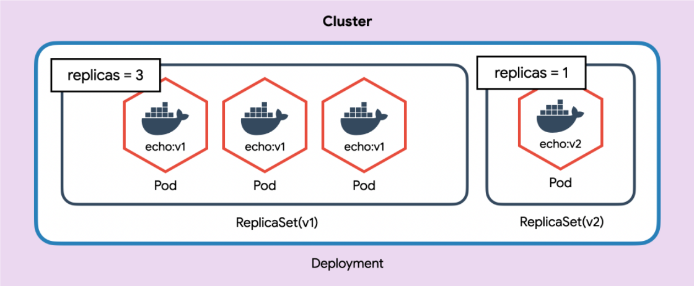
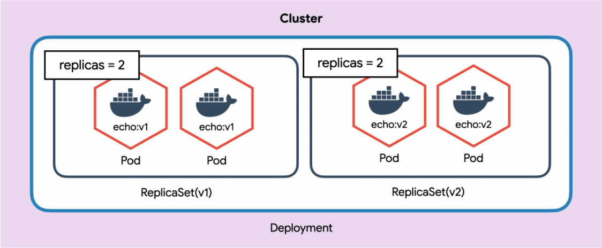
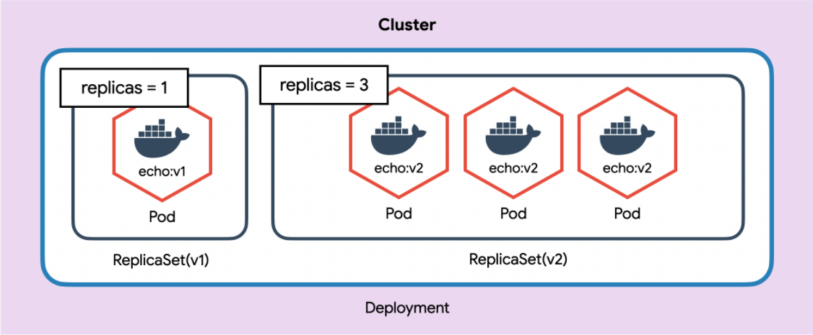
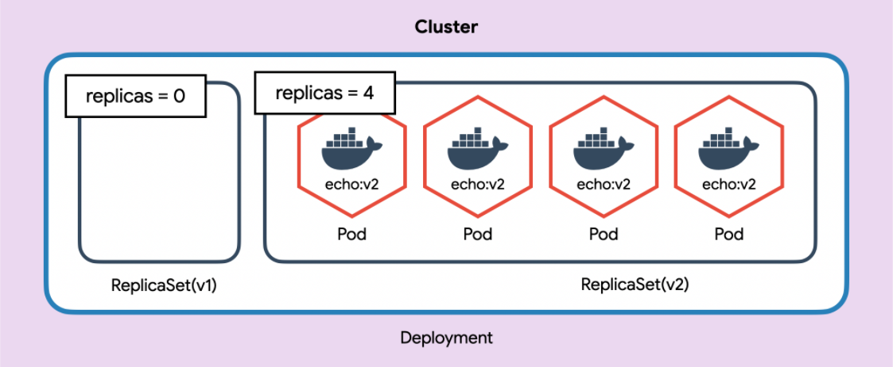
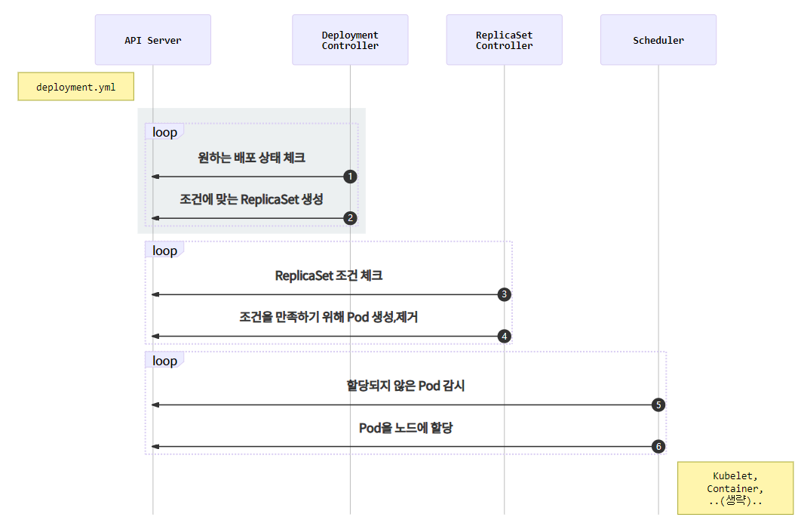

# Deployment

가장 많이 사용되는 오브젝트.

ReplicaSet을 이용하여 Pod를 업데이트하고 이력을 관리하여 롤백하거나 특정 버전으로 돌아갈 수 있음.


### Deployment 생성

```yaml
apiVersion: apps/v1
kind: Deployment
metadata:
  name: echo-deploy
spec:
  replicas: 4
  selector:
    matchLabels:
      app: echo
      tier: app
  template:
    metadata:
      labels:
        app: echo
        tier: app
    spec:
      containers:
        - name: echo
          image: ghcr.io/subicura/echo:v1
```

*`kind`를 제외하고 ReplicaSet과 내용이 동일*

```sh
# Deployment 생성
kubectl apply -f echo-deployment.yml

# 리소스 확인
kubectl get po,rs,deploy
```

```sh
NAME                               READY   STATUS    RESTARTS   AGE
pod/echo-deploy-76dcd9f4f9-clx78   1/1     Running   0          17s
pod/echo-deploy-76dcd9f4f9-jxnzx   1/1     Running   0          17s
pod/echo-deploy-76dcd9f4f9-kfl25   1/1     Running   0          17s
pod/echo-deploy-76dcd9f4f9-p8b85   1/1     Running   0          17s

NAME                                     DESIRED   CURRENT   READY   AGE
replicaset.apps/echo-deploy-76dcd9f4f9   4         4         4       17s

NAME                          READY   UP-TO-DATE   AVAILABLE   AGE
deployment.apps/echo-deploy   4/4     4            4           17s
```

**결과는 ReplicaSet과 비슷하지만 Deployment는 Pod를 새로운 이미지로 업데이트할때 유용.**

#### 이미지 태그만 변경하고 다시 적용

```yaml
apiVersion: apps/v1
kind: Deployment
metadata:
  name: echo-deploy
spec:
  replicas: 4
  selector:
    matchLabels:
      app: echo
      tier: app
  template:
    metadata:
      labels:
        app: echo
        tier: app
    spec:
      containers:
        - name: echo
          image: ghcr.io/subicura/echo:v2 # 변경된 부분
```

```sh
# 새로운 이미지 업데이트
kubectl apply -f echo-deployment-v2.yml

# 리소스 확인
kubectl get po,rs,deploy
```

```sh
NAME                               READY   STATUS    RESTARTS   AGE
pod/echo-deploy-77cd7699f4-jg7ws   1/1     Running   0          33s
pod/echo-deploy-77cd7699f4-rpbjx   1/1     Running   0          20s
pod/echo-deploy-77cd7699f4-rtgcv   1/1     Running   0          19s
pod/echo-deploy-77cd7699f4-rw29n   1/1     Running   0          33s

NAME                                     DESIRED   CURRENT   READY   AGE
replicaset.apps/echo-deploy-76dcd9f4f9   0         0         0       3m35s
replicaset.apps/echo-deploy-77cd7699f4   4         4         4       33s

NAME                          READY   UP-TO-DATE   AVAILABLE   AGE
deployment.apps/echo-deploy   4/4     4            4           3m35s
```

Pod가 모두 새로운 버전으로 업데이트.

> 새로운 버전의 Pod를 생성하고 기존 Pod를 제거


#### Deployment 업데이트 동작












#### Deployment 컨트롤러 동작




### 버전관리

Deployment는 변경된 상태를 기록.

```sh
# 히스토리 확인
kubectl rollout history deploy/echo-deploy

# revision 1 히스토리 상세 확인
kubectl rollout history deploy/echo-deploy --revision=1

# 바로 전으로 롤백
kubectl rollout undo deploy/echo-deploy

# 특정 버전으로 롤백
kubectl rollout undo deploy/echo-deploy --to-revision=2
```

