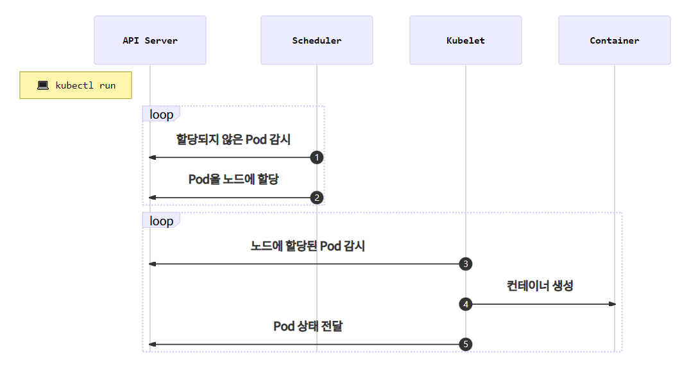
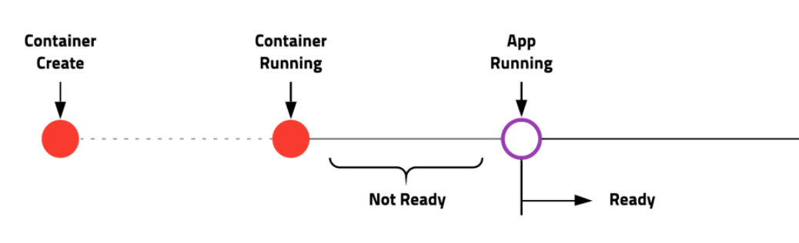

# Pod

쿠버네티스에서 관리하는 가장 작은 배포 단위.

도커는 컨테이너를 만들지만 쿠버네티스는 Pod를 생성.

Pod는 한개 또는 여러 개의 컨테이너를 포함.


* Pod 생성

```bash
# echo 라는 이름의 pod 생성
kubectl run echo --image ghcr.io/subicur/echo:v1
```

* Pod 목록 조회

```bash
kubectl get pod
```

```bash
NAME   READY   STATUS              RESTARTS   AGE
echo   0/1     ContainerCreating   0          10s
```

`STATUS` 는 정상적으로 생성되면 `Running`상태로 바뀜.

* 단일 Pod 상세 조회

```bash
kubectl describe pod/echo
```

```bash
Name:         echo
Namespace:    default
Priority:     0
Node:         minikube/192.168.64.5

...(생략)...

Events:
  Type    Reason     Age   From               Message
  ----    ------     ----  ----               -------
  Normal  Scheduled  68s   default-scheduler  Successfully assigned default/echo to minikube
  Normal  Pulling    68s   kubelet            Pulling image "ghcr.io/subicura/echo:v1"
  Normal  Pulled     35s   kubelet            Successfully pulled image "ghcr.io/subicura/echo:v1" in 33.176019499s
  Normal  Created    35s   kubelet            Created container echo
  Normal  Started    35s   kubelet            Started container echo
```

쿠버네티스를 운영하면서 가장 많이 확인하는 부분은 `Events`

* Pod 제거

```bash
kubectl delete pod/echo
```


#### Pod 생성 분석

#### YAML로 설정파일 작성

`kubectl run` 명령어는 실전에서 거의 사용하지 않고 YAML 설정 파일 활용.

``` yaml
apiVersion: v1
kind: Pod
metadata:
  name: echo
  labels:
    app: echo
spec:
  containers:
    - name: app
      image: ghcr.io/subicura/echo:v1
```

* **필수요소**

| 정의     | 설명          | 예                                            |
| -------- | ------------- | :-------------------------------------------- |
| version  | 오브젝트 버전 | v1, app/v1, networking.k8s.io/v1, ...         |
| kind     | 종류          | Pod, Replicaset, Deployment, Service, Ingress |
| metadata | 메타데이터    | name, label, annotation(주석) 으로 구성       |
| spec     | 상세명세      | 리소스 종류마다 다름                          |

```shell
# Pod 생성 (yaml 파일이 존재하는 경로에서)
kubectl apply -f echo-pod.yml
```


#### 컨테이너 상태 모니터링

컨테이너 생성과 실제 서비스 준비는 약간의 차이가 존재.




### livenessProbe

컨테이너가 정상 동작하는지 체크하고 정상 동작하지 않으면 컨테이너를 재시작하여 문제 해결.

이때 정상 동작을 체크하는 방법. 

> `httpGet`,  `tcpSocket`, `exec` 방법으로 체크

```yaml
apiVersion: v1
kind: Pod
metadata:
  name: echo-lp
  labels:
    app: echo
spec:
  containers:
    - name: app
      image: ghcr.io/subicura/echo:v1
      livenessProbe:
        httpGet:
          path: /not/exist
          port: 8080
        initialDelaySeconds: 5
        timeoutSeconds: 2 # Default 1
        periodSeconds: 5 # Defaults 10
        failureThreshold: 1 # Defaults 3
```

존재하지 않는 path를 입력하면 Pod가 여러 번 재시작 되고 `CrashLoopBackOff` 상태로 변경 됨.


### readinessProbe

컨테이너가 준비되어있는지 체크하고 정상 준비 상태가 아니면 Pod로 들어오는 요청을 제외.

livenessProve와 차이점 : 문제가 있어도 Pod를 재시작하지 않고 요청만 제외.

```yaml
apiVersion: v1
kind: Pod
metadata:
  name: echo-rp
  labels:
    app: echo
spec:
  containers:
    - name: app
      image: ghcr.io/subicura/echo:v1
      readinessProbe:
        httpGet:
          path: /not/exist
          port: 8080
        initialDelaySeconds: 5
        timeoutSeconds: 2 # Default 1
        periodSeconds: 5 # Defaults 10
        failureThreshold: 1 # Defaults 3
```

보통 `livenessProbe`와 `readinessProbe`를 같이 적용


### 다중 컨테이너

`1 Pod = 1컨테이너` 가 대부분 이지만 여러개의 컨테이너를 가진 경우도 존재.

하나의 Pod에 속한 컨테이너는 서로 네트워크를 localhost로 공유하고 동일한 디렉토리 공유.

```yaml
apiVersion: v1
kind: Pod
metadata:
  name: counter
  labels:
    app: counter
spec:
  containers:
    - name: app
      image: ghcr.io/subicura/counter:latest
      env:
        - name: REDIS_HOST
          value: "localhost"
    - name: db
      image: redis
```

*env = 환경변수*

