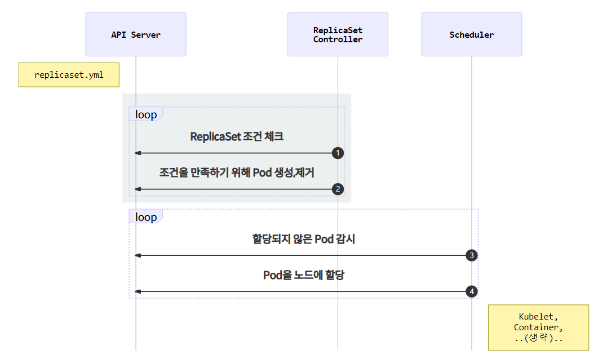

# ReplicaSet

**Pod를 단독으로 생성하면 문제 발생시 자동 복구가 되지 않는데, 이러한 Pod를 정해진 수 만큼 복제하고 관리하는 것**


### ReplicaSet 생성

```yaml
apiVersion: apps/v1
kind: ReplicaSet
metadata:
  name: echo-rs
spec:
  replicas: 1
  selector:
    matchLabels:
      app: echo
      tier: app
  template:
    metadata:
      labels:
        app: echo
        tier: app
    spec:
      containers:
        - name: echo
          image: ghcr.io/subicura/echo:v1
```

```sh
# ReplicaSet 생성
kubectl apply -f echo-rs.yml

# 리소스 확인
kubectl get po,rs
```

| 정의            | 설명              |
| --------------- | ----------------- |
| `spec.replicas` | 원하는 Pod의 개수 |
| `spec.selector` | label 체크 조건   |
| `spec.template` | 생성할 Pod의 명세 |


### ReplicaSet 동작




### 스케일 아웃

```yaml
apiVersion: apps/v1
kind: ReplicaSet
metadata:
  name: echo-rs
spec:
  replicas: 4  # Pod 개수 4
  selector:
    matchLabels:
      app: echo
      tier: app
  template:
    metadata:
      labels:
        app: echo
        tier: app
    spec:
      containers:
        - name: echo
          image: ghcr.io/subicura/echo:v1
```


**label을 이용하여 Pod를 체크하기 때문에 label이 겹쳐지지 않게 정의 필요.**

**ReplicaSet을 단독으로 쓰는 경우는 거의 없고 Deployment를 사용.**