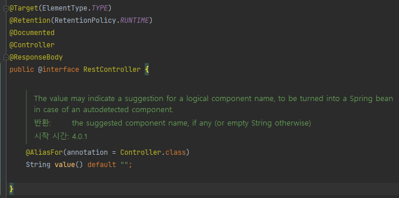

# @RequestBody,@ResponseBody

> 스프링에서 비동기 처리를 하는 경우 `@RequestBody`, `@ResponseBody`를 사용

### 클라이언트와 서버의 비동기 통신

클라이언트에서 서버로 통신하는 메시지를 요청(request), 서버에서 클라이언트로 통신하는 메시지를 응답(response) 메시지라고 한다.

웹에서 화면전환(새로고침) 없이 이루어지는 동작들은 대부분 비동기 통신으로 이루어진다.

비동기 통신을 하기 위해서는 클라이언트와 서버 간에 요청 메시지를 보낼 때, 본문에 데이터를 담아서 보내야 한다.

이 본문이 바로 body이고, 요청 본문은 RequestBody, 응답 본문은 ResponseBody.

본문에 담기는 데이터 형식은 여러가지가 있지만 가장 대표적인 것이 JSON.

즉, 비동기식 클라이언트-서버 통신을 위해 JSON 형식의 데이터를 주고 받는 것.

### @RequestBody

HTTP body 안의 JSON을 자바 객체로 변환하는 어노테이션

요청 헤더에 컨텐츠 타입(Content-Type) 필수.

```java
@RestController
@RequestMapping("/api")
public class HttpMessageController {

  /**
  * @RequestBody를 통해 자바 객체로 변환할 때 HttpMessageConverter를 사용하여 
  * 헤더에 담긴 컨텐츠 타입을 보고 어떤 메시지 컨버터를 사용할 것인지 판단하여 
  * 요청 본문에 담긴 값을 자바 객체로 변환
  */
  @GetMapping
  public String create(@ReqeustBody Event event) {
    // 생략
    return "redirect:/api/list";
  }
}
```

### @ResponseBody

자바 객체를 JSON으로 바꿔서 HTTP body에 담는 어노테이션

### @RestController

`@Controller`와는 다르게 `@ResponseBody`가 포함되어 있어서 별도로 어노테이션을 명시해주지 않아도 HTTP 응답데이터(body)에 자바 객체가 매핑되어 전달.



#### @Controller

보통은 `@Controller` 어노테이션을 사용 했을 때, **ViewResolver**에 의해 return 값으로 반환하는 문자열 이름의 view 페이지를 띄어줌.

**HelloCotroller.java**

```java
import org.springframework.stereotype.Controller;
import org.springframework.web.bind.annotation.RequestMapping;
import org.springframework.web.bind.annotation.RequestMethod;
import org.springframework.web.bind.annotation.ResponseBody;

@Controller
public class HelloController {

    @RequestMapping(value = "/helloworld", method = RequestMethod.GET)
    public String helloWorld() {
        return "helloworld";
    }

}
```

 **context.xml (View Resolver 설정)**

```xml
...
<bean id="viewResolver" class="org.springframework.web.servlet.view.InternalResourceViewResolver">
    <property name="prefix" value="/WEB-INF/jsp/"></property>
    <property name="suffix" value=".jsp" />
</bean>
...
```

 위와 같은 경우 `helloworld.jsp` 를 찾게 됨.