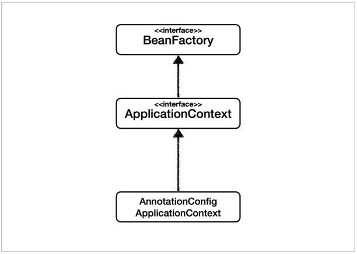

# BeanFactory와 ApplicationContext

#### BeanFactory

* 스프링 컨테이너의 최상위 인터페이스

* 스프링 빈을 관리하고 조회하는 역할을 담당

* getBean() 을 제공

 

#### ApplicationContext

* BeanFactory 기능을 모두 상속받아서 제공

* 애플리케이션을 개발할 때는 빈은 관리하고 조회하는 기능은 물론이고, 수 많은 부가기능이 필요

 

#### ApplicatonContext가 제공하는 부가기능

* 메시지소스를 활용한 국제화 기능 
  * 예를 들어서 한국에서 들어오면 한국어로, 영어권에서 들어오면 영어로 출력 

* 환경변수 
  * 로컬, 개발, 운영등을 구분해서 처리 

* 애플리케이션 이벤트 
  * 이벤트를 발행하고 구독하는 모델을 편리하게 지원 

* 편리한 리소스 조회 
  * 파일, 클래스패스, 외부 등에서 리소스를 편리하게 조회 

 

#### 정리 

* ApplicationContext는 BeanFactory의 기능을 상속 

* ApplicationContext는 빈 관리기능 + 편리한 부가 기능을 제공 

* BeanFactory를 직접 사용할 일은 거의 없음

* 부가기능이 포함된 ApplicationContext를 사용 

* BeanFactory나 ApplicationContext를 스프링 컨테이너라 함

     

참조 : 스프링 핵심 원리 - 기본편 (김영한) 강좌