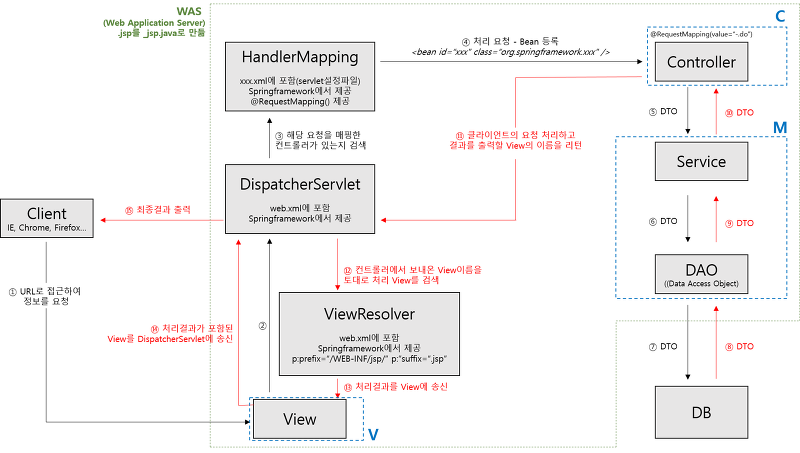

# Spring MVC 구조 및 동작

### Dispatcher-Servlet

* HTTP프로토콜을 통해 들어오는 모든 요청을 프레젠테이션 계층의 제일 앞에서 중앙집중식으로 처리해주는 프론트 컨트롤러(Front Controller)
* 클라이언트 요청을 받아서 컨트롤러에 요청을 전달하고 리턴받은 결과값을 View에 전달하여 응답을 생성

### HandlerMapping

* 클라이언트 요청 URL을 어떤 컨트롤러가 처리할지를 결정

### Controller

*  요청 정보를 읽고, 모델을 호출하고 데이터를 저장한 뒤에 DispatcherServlet 에 뷰 정보와 모델(데이터)을 보내주는 역할

### ViewResolver

* DispatchServlet 으로부터 전달받은 뷰의 정보를 가지고 어떤 뷰 객체를 전달할지, 해당 뷰의 경로가 어디인지를 다시 DispatchServlet 에게 전달(반환)해주는 역할

