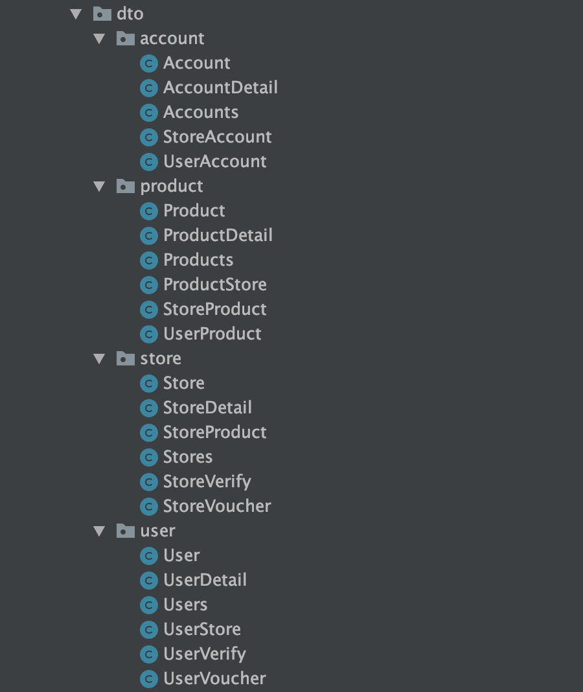

# 깔끔한 DTO 관리

* DTO 파일이 지저분해지는 이유.

  - Api별로 화면에 return하는 데이터가 달라 많은 DTO 파일을 생성.

  - Entity들의 데이터를 가공하여 DTO에 Set Method 혹은 builder로 매핑하는 코드가 길어짐. 



<br>

## 방법 : DTO를 Inner Class로

#### DTO를 사용하는 경우

> 1. POST Api에서 Request Payload를 매핑할 DTO
> 2. GET Api에서 Return해줄 Response DTO
> 3. 레이어를 옮겨다니거나 결과를 Return하기 위해 실제 User정보를 담은 DTO

```java
import lombok.AllArgsConstructor;
import lombok.Builder;
import lombok.Getter;
import lombok.Setter;

public class User {

    @Getter
    @AllArgsConstructor
    @Builder
    public static class Info {
        private int id;
        private String name;
        private int age;
    }

    @Getter
    @Setter
    public static class Request {
        private String name;
        private int age;
    }

    @Getter
    @AllArgsConstructor
    public static class Response {
        private Info info;
        private int returnCode;
        private String returnMessage;
    }
}
```

```java
import com.parksh.demo.dto.DefaultResponse;
import com.parksh.demo.dto.user.User;
import org.springframework.web.bind.annotation.*;

@RestController
@RequestMapping(“user”)
public class UserController {

    @GetMapping(“/{user_id}”)
    public User.Response getUser(@PathVariable(“user_id”) String userId) {

        return new User.Response(new User.Info(), 200, “success”);
    }

    @PostMapping
    public DefaultResponse addUser(@RequestBody User.Info info) {

        return new DefaultResponse();
    }
}
```

<br><br><br><br>

참조 : https://devsoyoung.github.io/posts/underfetching-overfetching/
