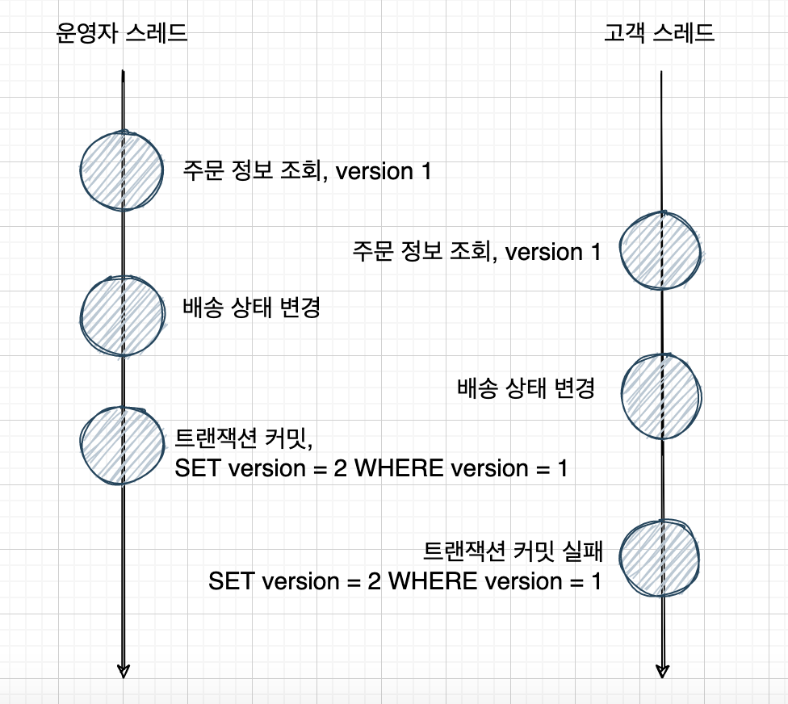

# 낙관적 잠금(Optimistic Lock)

### 낙관적 잠금

* 데이터 갱신시 충돌이 발생하지 않을 것이라고 낙관적으로 보고 잠금을 거는 기법.
* 디비에 락을 걸기보단 충돌 방지(Conflict detection)에 가까움
* JPA 에서는 낙관적 잠금을 쉽게 사용 가능
  * 동시에 동일한 데이터에 대한 업데이트가 서로 간섭하지 않도록 version이라는 속성을 확인하여 Entity의 변화를 감지하는 메커니즘
  * `@version` Annotation을 사용



##### @version 사용시 주의사항

1. 각 엔티티 클래스에 하나의 버전 속성만 존재
2. 여러 테이블에 매핑된 엔티티의 경우 기본 테이블에만 배치
3. 버전에 명시할 타입은 `int`, `Integer`, `long`, `Long`, `short`, `Short`, `java.sql.Timestamp` 중 하나

<br>

### 낙관적 잠금의 LockModeType

##### NONE

별도의 옵션을 사용하지 않아도 Entity에 @Version이 적용된 필드만 있으면 낙관적 잠금 적용.

##### OPTIMISTIC (READ)

Entity 수정시에만 발생하는 낙관적 잠금이 읽기 시에도 발생.

읽기 시에도 버전을 체크하고 트랜잭션이 종료될 때까지 다른 트랜잭션의 변경을 방지.

dirty read, non-repeatable read 방지

##### OPTIMISTIC_FORCE_INCREMENT (WRITE)

낙관적 잠금을 사용하면서 버전 정보를 강제 증가

<br>

### 사용법

```java
@Entity
public class Student {
    @Id
    private Long id;
    
    private String name;
    
    private String lastName;
    
    @Version
    private Integer version;
}
```
##### Find

```java
	entityManager.find(Student.class, studentId, LockModeType.OPTIMISTIC);
```

##### Query

```java
    Query query = entityManager.createQuery("select s from Student s where s.id = :id");
    query.setParameter("id", studentId);
    query.setLockMode(LockModeType.OPTIMISTIC_FORCE_INCREMENT);
    query.getResultList();
```

##### Explicit Locking(명시적 잠금)

```java
    Student student = entityManager.find(Student.class, studentId);
    entityManager.lock(student, LockModeType.OPTIMISTIC);
```

##### Refresh

```java
    Student student = entityManager.find(Student.class, studentId);
    entityManager.refresh(student, LockModeType.READ);
```

##### NamedQuery

```java
    @NamedQuery(name="optimisticLock",
      query="SELECT s FROM Student s WHERE s.id LIKE :id",
      lockMode = WRITE)
```


<br><br><br><br><br>

 refferenct : https://hwannny.tistory.com/81

https://velog.io/@lsb156/JPA-Optimistic-Lock-Pessimistic-Lock

https://www.baeldung.com/jpa-optimistic-locking?__cf_chl_f_tk=.76LEsMynHrH6G4LFWrC0WI3W5LkPoqFp3Vcc9saibE-1642581648-0-gaNycGzNC9E#3-explicit-locking