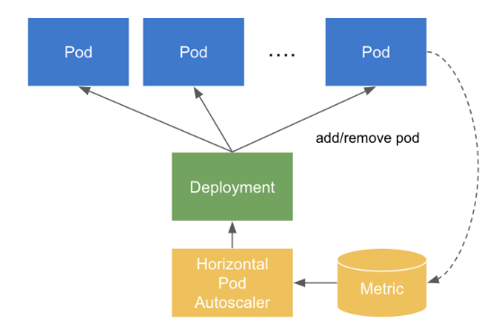

# HPA(HorizontalPodAutoscaler)

Pod의 수를 늘려서 스케일링

#### HPA의 동작 원리

1. Pod에서 메트릭을 저장해서 메트릭 서버에 저장(CPU, 메모리 같은 리소스 지표)
2. 지표들이 지정해놓은 임계점을 지나면 Pod의 수를 늘려서 스케일링
3. HPA는 메트릭을 모니터링하고 실제로 Pod의 수를 늘리거나 줄이는 것은 ReplicaSet이나 Deployment에 의해 컨트롤.



```yaml
apiVersion: autoscaling/v2beta1
kind: HorizontalPodAutoscaler
metadata:
  name: api-server
spec:
  scaleTargetRef:
    kind: Deployment
    name: api-server
    apiVersion: apps/v1
  minReplicas: 4
  maxReplicas: 8
  metrics:
    - type: Resource
      resource:
        name: cpu
        targetAverageUtilization: 50
```

CPU 사용량이 50% 이상이 되면 기본 4개에서 최대 8개까지 Pod를 스케일업.