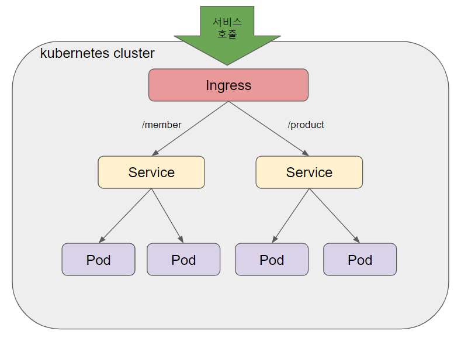

# Ingress

* HTTP(S) 기반의 L7 로드밸런싱 기능을 제공하는 컴포넌트

* 외부에서 쿠버네티스 내부로 들어오는 네트워크 요청을 어떻게 처리할지 결정
  *  외부에서 접근 가능한 URL 사용
  * 트래픽 로드밸런싱
  * SSL 인증서 처리
  * 도메인 기반으로 가상 호스팅 제공




```yaml
apiVersion: networking.k8s.io/v1
kind: Ingress
metadata:
  name: echo-v2
spec:
  rules:
    - host: v2.echo.192.168.64.5.sslip.io
      http:
        paths:
          - path: /
            pathType: Prefix
            backend:
              service:
                name: echo-v2
                port:
                  number: 3000
```

***V1.18이하 버전*** 

```yaml
apiVersion: networking.k8s.io/v1
kind: Ingress
metadata:
  name: echo-v2
spec:
  rules:
    - host: v2.echo.192.168.64.5.sslip.io
      http:
        paths:
          - path: /
            backend:
              serviceName: echo-v2
              servicePort: 3000
```


```sh
#Ingress 적용
kubectl apply -f ing.yml

#Ingress 상태 확인
kubectl get ingress
kubectl get ing
```

