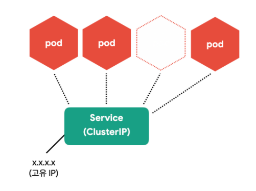
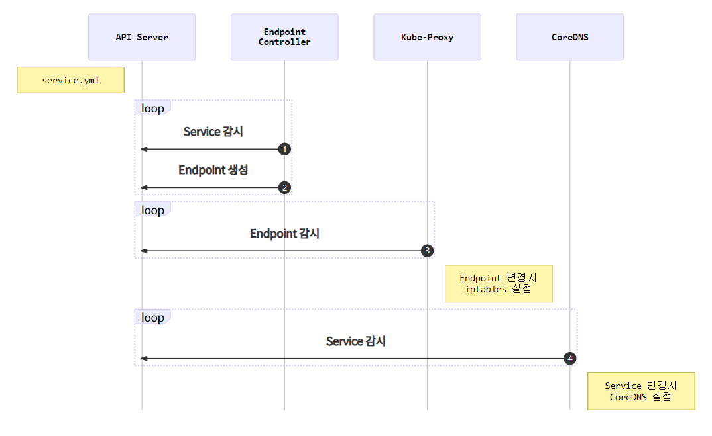

# Service

Pod는 자체 IP를 가지고 다른 Pod와 통신 할 수 있지만 쉽게 사라지고 생성되는 특징 때문에 직접 통신 방법은 권장하지 않음.

쿠버네티스는 Pod와 직접 통신하는 방법 대신, 별도의 고정된 IP를 가진 Service를 만들고 그를 통해 Pod에 접근.



<br>

## Service(ClusterIP) 생성

ClusterIP는 클러스터 내부에 새로운 IP를 할당하고 여러 개의 Pod를 바라보는 로드밸런서 기능 제공.

그리고 서비스 이름을 내부 도메인 서버에 등록해 Pod간에 서비스 이름으로 통신 가능.

ClusterIP는 클러스터 내부에서만 접근 가능.

```yaml
apiVersion: apps/v1
kind: Deployment
metadata:
  name: redis
spec:
  selector:
    matchLabels:
      app: counter
      tier: db
  template:
    metadata:
      labels:
        app: counter
        tier: db
    spec:
      containers:
        - name: redis
          image: redis
          ports:
            - containerPort: 6379
              protocol: TCP

---
apiVersion: v1
kind: Service
metadata:
  name: redis
spec:
  ports:
    - port: 6379
      protocol: TCP
  selector:
    app: counter
    tier: db
```

| 정의                    | 설명                                             |
| ----------------------- | ------------------------------------------------ |
| `spec.ports.port`       | 서비스가 생성할 Port                             |
| `spec.ports.targetPort` | 서비스가 접근할 Pod의 Port ( 기본: port 와 동일) |
| `spec.selector`         | 서비스가 접근할 Pod의 label 조건                 |

> 구분자
>
> 하나의 YAML파일에 여러 개의 리소스를 정의할 땐 "---"를 구분자로 사용

```sh
# 생성
kubectl apply -f counter-redis-svc.yml

# Pod, ReplicaSet, Deployment, Service 상태 확인
kubectl get all
```

```sh
NAME                         READY   STATUS    RESTARTS   AGE
pod/redis-57d787df44-mf5w5   1/1     Running   0          10s

NAME                 TYPE        CLUSTER-IP      EXTERNAL-IP   PORT(S)    AGE
service/kubernetes   ClusterIP   10.96.0.1       <none>        443/TCP    3d19h
service/redis        ClusterIP   10.103.50.102   <none>        6379/TCP   10s

NAME                    READY   UP-TO-DATE   AVAILABLE   AGE
deployment.apps/redis   1/1     1            1           10s

NAME                               DESIRED   CURRENT   READY   AGE
replicaset.apps/redis-57d787df44   1         1         1       10s
```

<br>

### Service 생성 흐름



### Endpoint

서비스의 접속 정보

```sh
kubectl get endpoints
kubectl get ep #줄여서

# redis Endpoint 확인
kubectl describe ep/redis
```

```sh
Name:         redis
Namespace:    default
Labels:       <none>
Annotations:  endpoints.kubernetes.io/last-change-trigger-time: ...
Subsets:
  Addresses:          172.17.0.2
  NotReadyAddresses:  <none>
  Ports:
    Name     Port  Protocol
    ----     ----  --------
    <unset>  6379  TCP

Events:  <none>
```

<br>

<br>

## Service(NodePort) 생성

클러스터 외부(노드)에서 접근 할 수 있는 NodePort 서비스.

```yaml
apiVersion: v1
kind: Service
metadata:
  name: counter-np
spec:
  type: NodePort
  ports:
    - port: 3000
      protocol: TCP
      nodePort: 31000
  selector:
    app: counter
    tier: app
```

| 정의                  | 설명                                                  |
| --------------------- | ----------------------------------------------------- |
| `spec.ports.nodePort` | 노드에 오픈할 Port (미지정시 3000~32768 중 자동 할당) |

```sh
kubectl apply -f counter-nodeport.yml

# 서비스 상태 확인
kubectl get svc
```

```sh
NAME         TYPE        CLUSTER-IP       EXTERNAL-IP   PORT(S)          AGE
counter-np   NodePort    10.101.168.165   <none>        3000:31000/TCP   13s
kubernetes   ClusterIP   10.96.0.1        <none>        443/TCP          3d19h
redis        ClusterIP   10.103.50.102    <none>        6379/TCP         30m
```

> NodePort와 ClusterIP
>
> NodePort는 CluterIP의 기능을 기본으로 포함

<br>

<br>

## Service(LoadBalancer) 생성

NodePort의 단점 : 노드가 사라졌을 때 자동으로 다른 노드를 통해 접근이 불가능

LoadBalancer 는 자동으로 살아있는 노드에 접근.

브라우저는 NodePort에 직접 요청을 보내지 않고 LoadBalancer에 요청하고 LoadBalancer가 살아있는 노드에 접근.

```yaml
apiVersion: v1
kind: Service
metadata:
  name: counter-lb
spec:
  type: LoadBalancer
  ports:
    - port: 30000
      targetPort: 3000
      protocol: TCP
  selector:
    app: counter
    tier: app
```

```sh
kubectl apply -f counter-lb.yml
```

```sh
NAME         TYPE           CLUSTER-IP       EXTERNAL-IP   PORT(S)           AGE
counter-lb   LoadBalancer   10.109.133.129   <pending>     30000:31535/TCP   9s
counter-np   NodePort       10.101.168.165   <none>        3000:31000/TCP    34m
kubernetes   ClusterIP      10.96.0.1        <none>        443/TCP           3d20h
redis        ClusterIP      10.103.50.102    <none>        6379/TCP          65m
```

> LoadBalancer와 NodePort
>
> LoadBalancer는 NodePort의 기능을 기본으로 포함
