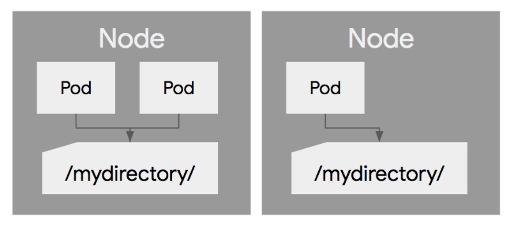
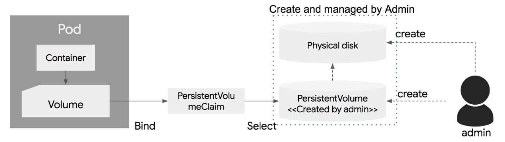

# Storage(emptyDir,hostPath,PV,PVC)

쿠버네티스에서 볼륨이란 Pod에 종속되는 디스크.

#### 볼륨 종류

| Temp     | Local    | Network                                                      |
| -------- | -------- | ------------------------------------------------------------ |
| emptyDir | hostPath | GlusterFS<br/>gitRepo<br/>NFS<br/>iSCSI<br/>gcePersistentDisk<br/>AWS EBS<br/>azureDisk<br/>Fiber Channel<br/>Secret<br/>VshereVolume |

<br>

## emptyDir

* Pod가 생성될때 생성되고 Pod가 삭제될때 같이 삭제되는 임시 볼륨
* Pod내의 컨테이너가 삭제되거나 재시작 되더라도 `emptyDir`의 생명주기는 컨테이너 단위가 아닌 Pod 단위이기 때문에 `emptyDir`은 삭제되지 않고 사용 가능.
* 생성 당시에 디스크에 아무 내용이 없기에 `emptyDir` 이라고 함.

```yaml
apiVersion: v1
kind: Pod
metadata:
  name: shared-volumes 
spec:
  containers:
  - name: redis
    image: redis
    volumeMounts:
    - name: shared-storage
      mountPath: /data/shared
  - name: nginx
    image: nginx
    volumeMounts:
    - name: shared-storage
      mountPath: /data/shared
  volumes:
  - name : shared-storage
    emptyDir: {}
```

> 하나의 Pod에 nginx와 redis 컨테이너를 기동시키고 `emptyDir` 볼륨을 생성하여 공유하는 설정

<br>

## hostPath

* hostPath는 노드의 로컬 디스크 경로를 Pod에서 마운트해 사용.
* 같은 hostPath에 있는 볼륨은 여러 Pod 사이에서 공유 가능
* Pod가 삭제되더라도 hostPath에 있는 파일은 삭제되지 않음.



* 하나의 Pod가 재시작되어 다른 노드에서 기동될 경우 이전 노드에서 사용한 hostPath의 파일 내용은 액세스 불가능

```yaml
apiVersion: v1
kind: Pod
metadata:
  name: hostpath
spec:
  containers:
  - name: redis
    image: redis
    volumeMounts:
    - name: terrypath
      mountPath: /data/shared
  volumes:
  - name : terrypath
    hostPath:
      path: /tmp
      type: Directory
```

<br>

## PV/PVC

#### [PersistentVolume / PersistentVolumeClaim]

> 일반적으로 디스크 볼륨을 설정하려면 물리적 디스크를 생성해야 하고, 이에 대한 설정을 자세하게 이해할 필요가 있다.
>
> 쿠버네티스는 인프라에 대한 복잡성을 추상화를 통해서 간단하게 하고, 개발자들이 손쉽게 필요한 인프라를 설정할 수 있도록 하는 개념을 가지고 있다.
>
> 인프로에 종속적인 부분은 시스템 관리자가 설정하도록 하고, 개발자는 이에 대한 이해 없이 간단하게 사용할 수 있도록 디스크 볼륨 부분에 PVC와 PV라는 개념을 도입하였다.

* 시스템 관리자가 실제 물리 디스크를 생성한 후 PV를 k8s에 등록
* 개발자는 Pod 생성시 볼륨 정의 및 PVC를 지정하여 PV와 연결



* **PV** : 물리 디스크를 k8s 클러스터에 표현한 것

* **PVC** : Pod의 볼륨과 PV를 연결하는 관계

* 볼륨은 생성된 후에 직접 삭제하지 않으면 삭제되지 않음.
* PV의 생명주기는 쿠버네티스 클러스터에 의해 관리되며 Pod의 생성, 삭제에 상관없이 별도로 관리.

### PersistentVolume 

```yaml
apiVersion: v1
kind: PersistentVolume
metadata:
  name: pv0003
spec:
  capacity:
    storage: 5Gi
  volumeMode: Filesystem
  accessModes:
    - ReadWriteOnce
  PersistentVolumeReclaimPolicy: Recycle
  StorageClassName: slow
  mountOptions:
    - Hard
    - nfsvers=4.1
  nfs:
    path: /tmp
    server: 172.17.0.2
```

| 옵션                          | 설명                                                         |
| ----------------------------- | ------------------------------------------------------------ |
| capacity                      | 볼륨의 용량 정의                                             |
| volumeMode                    | Filesystem(default) 또는 raw를 설정 가능                     |
| PersistentVolumeReclaimPolicy | PV는 연결된 PVC가 삭제 된 후 다른 PVC에 의해 재사용이 가능한데 재사용시 디스크 내용을 삭제 또는 유지 할지에 대한 정책을 설정 가능<br>* Retain : 삭제하지 않고 PV의 내용 유지<br />* Recycle : 재사용 가능하며, 재사용시 데이터의 내용을 자동으로 삭제<br />* Delete : 볼륨의 사용이 끝나면 해당 볼륨 삭제.<br />*ReclaimPolicy 는 디스크의 특성에 따라 적용이 불가능 할 수 있음* |
| accessModes                   | PV에 대해 동시에 Pod에서 접근할 수 있는 정책 정의<br />* ReadWriteOnce : 해당 PV에 하나의 Pod만 마운트되고 하나의 Pod에서만 읽고 쓰기 가능.<br />* ReadOnlyMany : 여러개의 Pod에 마운트 가능하며 동시에 읽기 가능하나 쓰기는 불가.<br />* ReadWriteMany : 여러개의 Pod에 마운트 가능하며 동시에 읽기/쓰기 가능 |

### PersistentVolumeClaim

```yaml
apiVersion: v1
kind: PersistentVolumeClaim
metadata:
  name: myclaim
spec:
  accessModes:
    - ReadWriteOnce
  volumeMode: Filesystem
  resources:
    requests:
      storage: 8Gi
  storageClassName: slow
  selector:
    matchLabels:
      release: "stable"
    matchExpressions:
      - {key: environment, operator: In, values: [dev]}
```

| 옵션                   | 설명                                                         |
| ---------------------- | ------------------------------------------------------------ |
| accessMode, VolumeMode | PV 와 동일                                                   |
| resources              | 필요한 볼륨의 사이즈 정의                                    |
| selector               | label selector 방식으로 이미 생성되어 있는 PV 중에 label에 매칭되는 볼륨을 찾아 연결 |

<br>

### Dynamic Provisioning

PVC만 정의하면 이에 맞는 물리디스크 생성 및 PV 생성을 자동화해주는 기능

쿠버네티스 1.6 부터 지원


* PVC를 정의하면 이 내용에 따라 쿠버네티스 클러스터가 물리 Disk를 생성하고 이에 연결된 PV를 생성
* 디스크를 생성 할 때 필요한 디스크 타입을 정의 : StorageClass
* PVC에 storage class를 지정하면 이에 맞는 디스크를 생성

```yaml
apiVersion: v1
kind: PersistentVolumeClaim
metadata:
  name: mydisk
  namespace: dex-prod
  labels:
    app: mydisk
spec:
  accessModes:
    - ReadWriteOnce
  resources:
    requests:
      storage: 10Gi
  storageClassName: slow
  volumeMode: Filesystem
```

```yaml
apiVersion: storage.k8s.id/v1
kind: StorageClass
metadata:
  name: slow
provisioner: kubernates.io/aws-ebs
parameters:
  type: io1
  zones: us-east-1d, us-east-1c
  iopsPerGB: "10"
```

<br>

<br>

<br>

출처: https://bcho.tistory.com/1259 [조대협의 블로그]